# Lecture 1: Digital Age

## Computers through the ages

- 1964: ENIAC, $63m^2$, 30 tons
- 1950: EDVAC, $45m^2$, 7850kg
- 1959-1965: 2nd Gen Mainframe Computer (IBM 7094), Transistor
- 1965-1971: 3rd Gen Mini Computer, Integrated Circuit
- 1971- now: 4th Gen Micro Computers, Very Large Scaale Integration

## Define Computer

- A programable machine designed to automatically carry out a seequence of arithmatic or logical operations

## Types of Computers

- Supercomputer
- Personal Computer (laptop, tablet, smartphone)
- Embedded Computer (Smartwatch, TV control box)

## Timing

- Majority of  digital circuits aree sychronus
- means have clock signal (heart bit of system hehehaha)

## Binary logic

- Positive logic: High = 1, Low = 0
- Negative logic: High = 0, Low = 1
- computer has 4 limits, making 3 bands: V(L min), V(L max), V(H min), V(H max)
- any voltage between V(L max) and V(H min) is part of unacceptable value
- 3 bands are High Unacceptable and Low
  
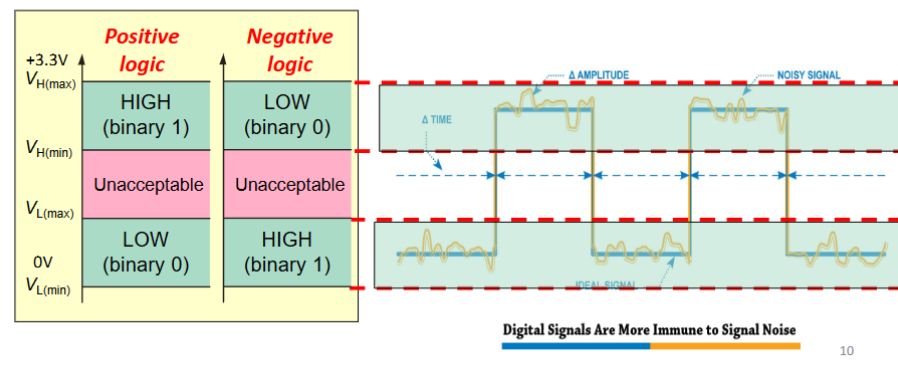

## Info Size

|Name|Size ***(Bit)***|Additional Math|
|-|-|-|
|Bit             |1                |           |
|Byte            |8                |           |
|Word            |16               |  2 * 8 bit|
|Kilo**BIT** (Kb)|1024             | 128 * Byte|
|Mega**BIT** (Mb)|1,048,576        |1024 * Kilo|
|Giga**BIT** (Gb)|1,073,741,824    |1024 * Mega|
|Tera**BIT** (Tb)|1,099,511,627,776|1024 * Giga|

|Name|Size ***(Byte)***|Additional Math|
|-|-|-|
|Bit              |1                |           |
|Byte             |8                |           |
|Word             |16               |  2 * 8 bit|
|Kilo**BYTE** (KB)|1024             |1024 * 8 = 8,192 bit |
|Mega**BYTE** (MB)|1,048,576        |1024 * Kilo = 8,388,608 bit        |
|Giga**BYTE** (GB)|1,073,741,824    |1024 * Mega = 8,589,934,592 bit    |
|Tera**BYTE** (TB)|1,099,511,627,776|1024 * Giga = 8,796,093,022,208 bit|

Note:  
When refering to info size, kilo is 1024.  
When refering to speeds e.g. sample rate, kilo is 1000

## Bit importance

- MSB = Most significant bit i.e. bit representing largest value
- LSB = Least significant bit i.e. the ones bit
- for *n-bit* word, has $2^n$ permutation

|  0|0|0|0|0|0|0|0  | 
|:-:|-|-|-|-|-|-|:-:| 
|  ^|-|-|-|-|-|-|^  |  
|MSB|-|-|-|-|-|-|LSB|

## Analogue to Digital Signal

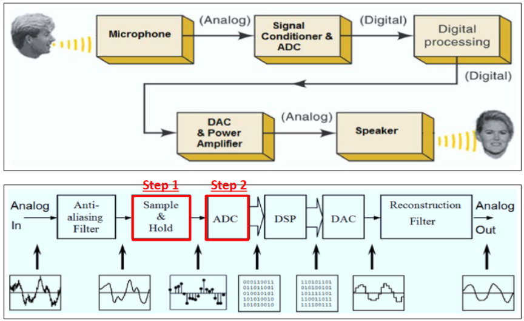

Sampling vs quantization  
- Sampling is by time (x-axis)  
  - done by sample and hold circuit  
- Quantization is by value (y-axis)  
  - done by ADC circuit  
- Sampling = cutting up the signal into discrete time blocks  
- quantization = cutting up the signal amplitude into equal steps  
- quantization **NOISE** = difference between input value and quantized value  

Nyquist Rate  
- Sampling frequency **MUST BE** $>2 * max\ freq\ of\ input$.  
- $f(sample) > 2 * f(input)$  
- $f(sample)$ **cannot be equals to** $2 * f(input)$.  
- If unlucky and $f(sample) = 2 * f(input)$, possible to only sample the 0 value of the wave  

- Sampling rates 
  - 1s = 1Hz  
  - 1ms = 0.001s = 1KHz  
  - 1us = 0.001ms = 0.000001s = 1MHz  
  - 1ns = 0.001us = 0.000001ms = 0.000000001s = 1Ghz

Quantiztion steps should also be reasonably small.  
Example:  
input voltage 0.3, but quantize voltage is 1 and -1 then will have error.  
even for 1, 0.33, -0.33, -1, value of 0.35 will be rounded wrongly

Quantization will determine how many bits each channel needs per sample.  
Usually 8, 10, 12, 16, 24

## Von neuman strikes again

von neumaen arch = stored program concept   
define computer: CPU , Memory , I/O  
addr / control bus: uni-directional  
data but: bi-directional

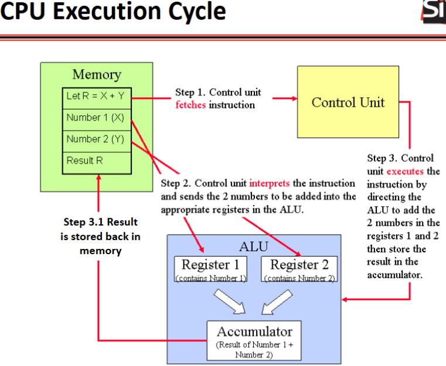

### Memory

memory operations: read, write  
simplified write op = data move *TO* memory, overwrite old data  
read op = ***COPY*** data from memory, memory no change  

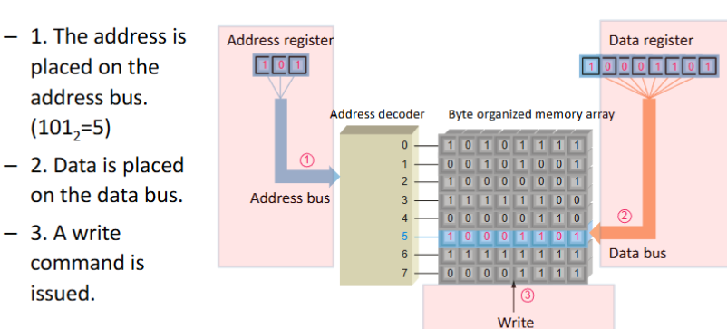
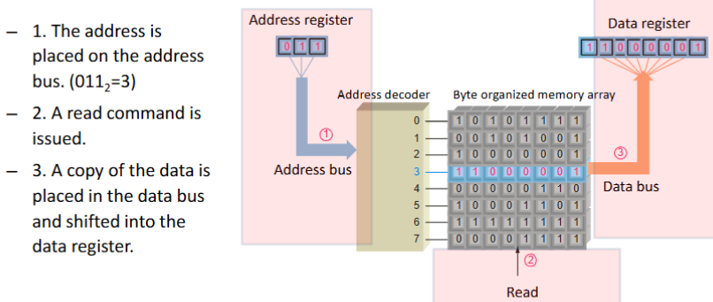

## Busses

processors generally described by addr buses or data busses  
usually prefer data bus as determines how much data per cycle

### Addr bus

uni- directional  
addressable space / mem locations = $2^{addr\ lines}$

### Data bus

bi-directional  
num_lines = size of 1 read op  
i.e. 16 bus line = 16 bit read per cycle  
total space in mem = num_addr_lines * num_data_lines

### Control Bus

coordinate operation + communicate w/ external devices

## Memory Hierarchy

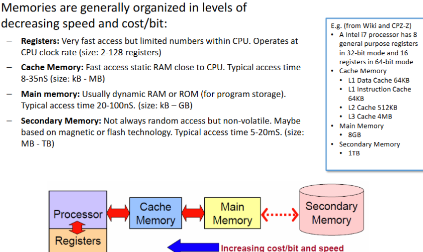

## Other computer bits

Operating System (OS oer Kernel)  
  - controls and manages the available hardware resources.  
  - has special access privileges to certain categories of instructions and certain hardware  
  - Tasks:  
    - boots up machine  
    - loads user program  
    - allocates main memory/storage space  
    - schedules concurrent user programs  
    - drivers to service various devices (terminals, printers, etc.)  
    - 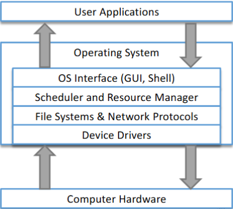  

# Lecture 2: Number systems

## Positional Number systems

Decimal binary hexadecimal are positional number systems  
the position of each digit determines and represents a different power of 10, 2 or 8  
You maybe able to determine which number system is being used based on which digits are present.  
e.g.  
- 90FE is cnfm hex  
- 9081 maybe decimal or hex  
- 1011 maybe decimal, hex or binary  

you denote the system you using subscript $_2$ or $_{16}$  
hex sometimes denoted with a 0x or H` as prefix  

apparently you can write binary decimal as well  
$$1011.11 = 1[2^3] + 0[2^2] + 1[2^1] + 1[2^0] + 1[2^{-1}] + 1[2^{-2}]$$

## Signing a number

|Type|rep values|8 bit|16 bit|
|-|-|-|-|
|n-bit unsigned binary|$0$ to $+(2^n-1)$|0 - 255| 0 - 65535 |
|n-bit sign-magnitude binary|$-(2^{n-1}-1)$ to $+(2^{n-1}-1)$|-127 - +127|-32767 - +32767|
|1's complement|$-(2^{n-1}-1)$ to $+(2^{n-1}-1)$|-127 - +127|-32767 - +32767|
|2's complement|$-2^{n-1}$ to $+(2^{n-1}-1)$|-128 - +127|-32768 - +32767|

Sign-magnitude representation  
- just means num is signed. does not tell you HOW it's signed

n-bit sign-magnitude binary results in +ve 0 and -ve 0 representation

1's complement is the WEIRD way to sign and is not used in computers  
- the complement of a binary digit is the inverse of all the digits.  
- i.e: 010 for 2, 101 is -2  

1's complement more easy to use in circuits as you just NOT gate each binary digit.  
to derive -ve number for 1's complement, find +ve value first, then invert all bits  

2's complement is the default way to sign  
- take the +ve value and invert bit like 1s complement  
- add 1  
- finish  

removes -0 representation

## addition, sub traction and overflow

|1st num|2nd num|output|Overflow?|
|-|-|-|-|
|+|+|+|maybe|
|-|-|-|maybe|
|+|-|+/-|No|
|-|+|+/-|No|

Assume next 2 cases are 4 bit only system

$$1111_2 + 1111_2 = [1]1110_2$$

^ in this case you run out of bits.  
so you change carry flag to 1  
but since MSB is still negative, logic is correct so overflow flag is still 0
_____________

$$1001_2 + 1010_2 = [1]0011_2$$

^ in this case also run out of bits.  
so you change carry flag to 1.  
since MSB is 0 but both initial values MSB was 1, logic has failed as output is positive.  
Thus, overflow flag must be changed to 1
______________

|       |$^2->^1$|$^2$|   |   |
|:-----:|:------:|----| - | - |
|~~[1]~~|    0   | 0  | 1 | 1 |
|   -   |    0   | 1  | 1 | 0 |
|       |    1   | 1  | 0 | 1 |

^ borrow imiginary bit, 3-6 = -3 so logic ok, no overflow  

|       |   |     | $^2$|$^2$|
|:-----:|---|-----|  -  | -  |
|       | 0 |~~1~~|~~1~~| 0  |
|   -   | 0 |  0  |  1  | 1  |
|       | 0 |  0  |  1  | 1  |

^ 6-3 = 3 so logic ok, no overflow

|       |     |$^2->^1$| $^2$|$^2$|
|:-----:|:---:|:------:|  -  | -  |
|       |~~1~~|    0   |~~1~~| 0  |
|   -   |  0  |    0   |  1  | 1  |
|       |  0  |    1   |  1  | 1  |
  
^^ -6-3 = 7, logic fail, overflow

if number is positive, can extend leading bits with 0  
e.g. 0011 = 0000 0011  
if number is negative, can extend leading bits with 1  
e.g. 1001 = 1111 1001

## IEEE-754 Mantissa

$$(-1)^{sign} * 1.mantissa *2^{(exponent-127)}$$

NOTE: Exponent is unsigned.  
Exponent is how many times you shift the binary point to the left,  
in this case moved right so is -1 and change exponent bias -127 to +127

$25.75$ to IEEE-754  
split decimal into whole num and fractional  

|whole|fractional|
|-|-|
|25|0.75|

Find binary equivalent of fractional part
$$ 0.75*2 = 1.5 \ \ \ -> (1)$$
$$ 0.5*2 = 1.0 \ \ \ -> (1)$$  
binary equivalent: $11001.11_2$  
move binary point to the **left** until you get $1.matissa$
$$11001.11 -> 1.100111$$  
Note: Moved to left **(4)** times, this will be the **Exponent**  

- Sign: is +ve so sign = 0  
- Mantissa = 1.**[100111]** from 1.100111  
- Exponent : 4 = exp-127 => 131 = 10000011  

NOTE: Exponent is unsigned.

_______

$.75$ to IEEE-754  
split decimal into whole num and fractional  

|whole|fractional|
|-|-|
|0|0.75|  

Find binary equivalent of fractional part
$$ 0.75*2 = 1.5\ \ \ -> (1)$$
$$ 0.5*2 = 1.0\ \ \ -> (1)$$  
binary equivalent: $0.11_2$  
move binary point to the **right** until you get $1.mantissa$  
$0.11 -> 1.1$  
Note Moved to right (1) times, This will be the exponent 
- Sign: is +ve so sign = 0  
- Mantissa = 1.[1] from 1.1  
- Exponent : -1 = exp+127 => 126 = 10000011  

## Binary Coded Decimal (BCD)

BCD vals <= 9  
rep decuimal val in binary  
not a number system  
$874_{10} = 1000\ 0111\ 0100_{BCD}$

## Gray code

only one bit change at a time  
00 -> 01 -> 11 -> 10  
cannot go from 01 -> 10

## Serial vs Parallel

Serial: transfer one bit at a time  
is slow  
use case: longer range transmission (USB, TCP/IP, RS232, SATA)  

Parallel: transfer multiple bits at once  
is fast  
Subhect to synchronisation issues
use case: short range communication (ATAPI, internal buses)

## Parity

used to identify errors by adding 1 bit to the data  
Parity bit is attached to a group of bits to make the total number of 1s in a group always even (Even parity) or always odd (Odd parity).  

Parity type is agreed between users before sending data  
if error detected, parity cannot recover the data.  
Parity can be added as LSB or MSB, depend on user agreement  

|Parity Type|example|sum of 1's|
|-|-|-|
|Even| 1011 011[1] | 6 |
|Odd | 1011 011[0] | 5 |

Other error detection: Cyclic redundancy check (CRC), Hamming code

# Topic 3: Combinatorial Circuits

Generally: True = 1, False = 0  
Logic circuits types:  
- Combinatorial  
  - Output depends only on current inputs  
- Sequential  
  - Output depends not only on current inputs but past sequence of inputs

ALU is Combinatorial circuit, doesnt use clock

Control Unit and Registers are sequential circuits, uses clock

Basic logic ops:  
- AND  
- OR  
- NOT  
 
## AND

$Z_{AND} = A . B = A ∧ B$

|$A$|$B$|$Z_{AND}$|
|-|-|-|
|0|0|0|
|0|1|0|
|1|0|0|
|1|1|1|

## NAND

NOT AND

$Z_{NAND} = \bar{A . B} = \bar{A ∧ B}$

|$A$|$B$|$Z_{NAND}$|
|-|-|-|
|0|0|1|
|0|1|1|
|1|0|1|
|1|1|0|

## OR

$Z_{OR} = A + B = A ∨ B$

|$A$|$B$|$Z_{OR}$|
|-|-|-|
|0|0|0|
|0|1|1|
|1|0|1|
|1|1|1|

## NOR

NOT OR

$Z_{NOR} = \bar{A + B} = \bar{A ∨ B}$

|$A$|$B$|$Z_{OR}$|
|-|-|-|
|0|0|1|
|0|1|0|
|1|0|0|
|1|1|0|

## Boolean algebra Characteristics:

Will be in quick reference sheet

## Propogation delay

takes time for electricity to travel through circuit, time taken ($\Delta t$)  

## Canonical form

any bool function expressed as: sum of minterms / product of maxterms  
minterms = set of inputs such that bool func = 1  
max term = set of inputs such that bool func = 0  

## Sum of Product
basically "sum" (basically or) all options in truth table that output 1 (i.e. minterm)  
each input needs to be a one in the equations.  

e.g.  
A = 0  
B = 1  
C = 1  
equation part for this line in truth table is \'ABC
e.g.
ABC and A\`BC give 1, then $ABC\ OR\ A\`BC$ = $ABC + A\`BC$

## Product of Sum
basically "multiply" (basically and) all options in truth table that output 0 (i.e. maxterm)  
e.g.  
ABC and A\`BC give 0, then $ABC\ AND\ \`ABC$ = $ABC . \`ABC$

## Simplification of circuit

|tag|Performance Consideration|description|
|-|-|-|
|g|Num gates|total num gates|
|gi|num gate input literals|total inputs to all gates|
|mpl|max path len|number of layers of gates|
|mfi|max fan-input|num of inputs into gate with most inputs|

## Ripple (carry) adder

made of half adder and full adder  
2x half adder = full adder  
  
  
  

chaining multiple full adders together can add N-bit numbers  
each carry bit "ripples" to next full adder  
slow for many bits
- Since the carry may need to be propagated along the longest path from the LSB to
the MSB, the delay is proportional to the bit length to be added.

  

## 7 seg display

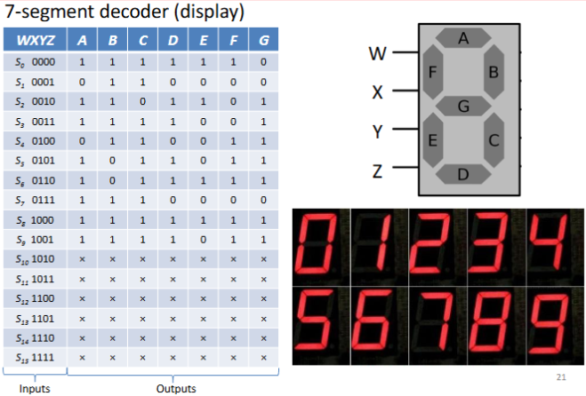

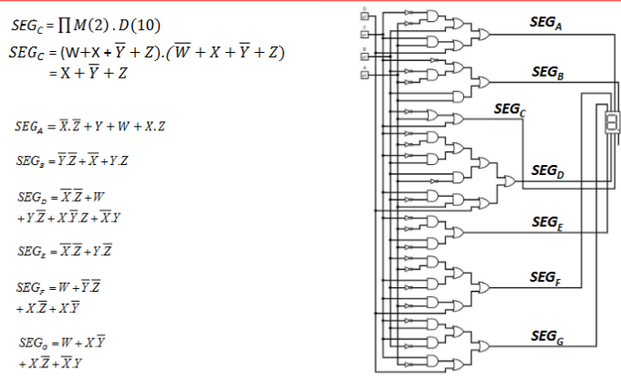

## MUX and DEMUX

MUX is choose 1 of many and send through one output  

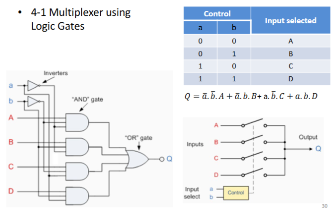

DEMUX is choose 1 of many output using an isolated select input and send data from single input

N-Multiplexer  
- has $2^n$ inputs  
- has n select(address) inputs  
- has 1 output

high level multiplexer can be constructed using lower level multiplexer

for multiplexer gate, sel = 0 is choose top, sel = 1 is choose bottom

multiplexer equation:
use control inputs and which input selected  
for which input selected, assume val is 1

e.g.  

multiplexer boolean:  

## Logic Shift

SL = Shift left, multiply by 2
SR = Shift Right, divide by 2

does not preserve sign bit  
once shifted, vacant positions filled usually by 0

 

## Comparator

used to check if bit is =, > or <

n-bit comparator:  
2 ways to do:  
- binary subtraction: outputs: >= or <  
- XOR each bit or inputs then OR all XOR ouput: outputs: =, !=  

  

if combine both circuit, n-bit comparator done

|Subtraction|XOR|result|
|:---------:|:-:|:----:|
|     0     | 0 |  x   |
|     0     | 1 |  <   |
|     1     | 0 |  =   |
|     1     | 1 |  >   |

# Topic 4: Sequential Circuits

Combinatorial: No clock, based on input

Sequential: need clock, uses current input and previous inputs

Latches / flip-flop like 1-bit memory

Current / present state = $Q$ or $Q_n$
Next / future state = $Q^+$ or $Q^+_n$

Number in middle of latch box is possible states, e.g. 0/1 means output is 0/1 or 1/0

## SR Latch

R: Reset, Q = 0  
S: Set, Q = 1

Dual NOR: Active High (no change when both input 0)  
|S|R|     $Q^+$     |  Comments |
|-|-|---------------|-----------|
|0|0|       Q       | No Change |
|0|1|       0       |   Reset   |
|1|0|       1       |    Set    |
|1|1|Undeterministic|Not allowed|

Dual NAND: Active Low (no change when both input 1)  
|S|R|     $Q^+$     | Comments  |
|-|-|---------------|-----------|
|0|0|Undeterministic|Not allowed|
|0|1|       0       |    Set    |
|1|0|       1       |   Reset   |
|1|1|       Q       | No Change |

## D-latch

Variation of SR latch

Q follows D when EN=1

|EN|D|$Q^+$|$\bar{Q}^+$|Comments|
|-|-|-|-|-|
|0|0|Q|$\bar{Q}$|No Change|
|0|1|Q|$\bar{Q}$|No Change|
|1|0|0|1|Reset|
|1|1|1|0|Set|

## D Flip-Flop

latch level-sensitive (aka input sensitive)  
Flip Flop edge-sensitive (only change on clock edge)  
Flip Flop reduces noise from inputs like short spike on input  

PGT: Positive edge triggered: Q follows D on Rising edge (Clock 0 -> 1)  
NGT: Negative edge triggered: Q follows D on Falling edge (Clock 1 -> 0)

Input to D is not bound to clock.  
BUT D flipflop is sync as any changes to the Flip-Flop only occur on clock change

|CLK|D|$Q$|$\bar{Q}$|Comments|
| - |-| - |    -    |   -    |
| ↑ |0| 0 |    1    |  Reset |
| ↑ |1| 1 |    0    |  Set   |

how to read:
When see rising edge, check D and set Q to D

## JK-Flip-Flop

|J|K|CLK|$Q^+$|
|-|-|-|-|
|0|0|↑|Q, No Change|
|0|1|↑|1|
|1|0|↑|0|
|1|1|↑|$\bar{Q}$, Toggle|

CLR and PR are async inputs as the changes they make are done when inputs sent, not when clock change

inputs J and K are async  
But JK flipflop is sync as change on clock change

When CLR = 0, Q = 0
When PR = 0, Q = 1

## Propogation Delay

measured between the 50% level of the clock to the 50% level of the output transition

setup time =  min time for data to be **present before** clock  
hold time = min time for data to **remain after** clock  

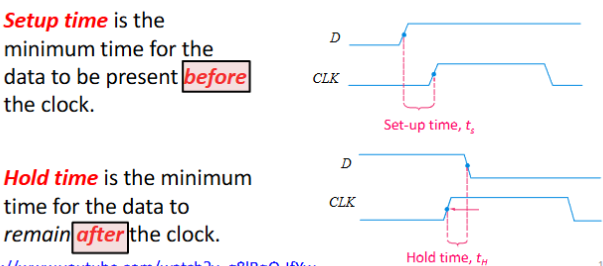

## Flip-Flop usage

1. Memory
    - Registers are groups of flip-flops connected to parallel data lines, store data till next clock pulse

2. Freq Divider
    - Chain JK flip-flop together in toggle mode each flip flop will half clock freq as is a base 2 system
    - important for components that operate on different frequencies (Bluetooth, wifi, CPU, USB)

3. Control Unit / Finite State Machines
    - Backbone of control unit
    - Counters

## Electronic implementation

TRANSISTORS MAKE THIS WORK BABY

CMOS (Complementary Metal Oxide Semiconductor)
MOSFET (Metal Oxide Silicon Field Effect Transisitor)
Best size as of 2025: 5nm

CMOS uses MOSFETs

Used to make basic logic gates

|type|V = 0|V = 1|
|-|-|-|
|PMOS: pull-up|on (Q = 1)|off(Q = 0)|
|NMOS: pull-down|off(Q = 0)|on(Q = 1)|

|gate|num N-Type|num P-Type|Total|
|-|-|-|-|
|NOT|1|1|2|
|NAND|2|2|4|
|NOR|2|2|4|

## Hardware description lang (ASIC vs FPGA)

FGPA = Field-programable gate array  
Manufacturers: Xilinx, Altera, Acatel  
integrated circuit designed to be configured by the customer or designer after manufacturing  
Most designs are FPGA  
can be 'soft' upgraded  
often described as a ‘sea of gates’  
contains programable logic blocks with look-up-tables and flip-flops  
has programable routing to connect blocks together  
has I/O blocks for board-level connections  

ASIC = Application Specific Integrated Circuit  
Integrated device manufacturer (IDM) ASIC suppliers: TSMC, SMIC, Global Foundries, etc  
Fabless ASIC suppliers: Broadcom, Delta, Nvidia  
integrated circuit (IC) customized for a particular use  

will reach a point where using low level gates is too messy (i.e. 100 000 gate designs), so switch to Hardware description lang (HDL).  
HDL is abstract behavioral models, used to provide precise specs and framework for designers  

Similar idea to libraries in coding, build reuseable blocks to call on  

HDL langs: Verilog or VHDL  

# Unified Model lang

actor: user role, exists outside system, may interact

boundary: divide whats in system and out of system (environment), shows scope, actor outside, use case inside

use case: a function that actor can do in system (oval shape)

use case diagram useful for:  
- identify all actors in problem domain
- show all actions that need to be ccompleted
- simple not technical

## Connection

is an assosication between actor and use case, shows which actor can use what function  
does not include data flow  

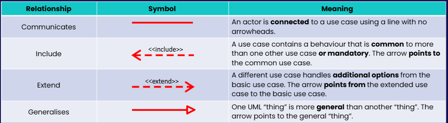

Connecting line: arrow or line showing behaviour relation

include: func a is shared by other funcs and is a pre-requisite for other funcs to exist

extend: func A is an additional OPTIONAL feature to base function

generalise: points from subset of users to super set of users (e.g. part time students -> students)

# Topic 6: Database -Entity Relationship (ER)

Why learn database: repository for data generated. 

What is db: organised collection of data  
- multiple formats / structures  
- stored in some form of storage medium (hdd, flash mem, ssd, dram)  
- can be stored anywhere in the world using cloud tech  

How to store?  
txt? but is 1 record per line  
disadvantage:  
- file corruption(if fail during write op)  
- custom scripts to manage files  
- multiple people cannot update data at the same time (concurrency)  
- no security  
- difficult to search/catagorise  
- hard to track access (data logging of file access)  

spreadsheet? xlsx?  
- slightly more organised  
- file corruption  
- no security  
- hard to track access (data logging of file access)  

correct way: Database Management system (DBMS)  
complete software system to define, create, manage, update and query DB  
e.g.: myswql, oracle, ingres, postgresql, couchdb

DBMS has application layer and database management layer  
users use application layer to create db requests, for ease of use  
application reuests sent to dbms which manages access and logging to actual db  

data models
- high level description, hides low-level storage details (dbms manage)
- usrs define how data is organised in dbms
- examples of models
  - hierarchical
  - network
  - object-oriented
  - object-relational
  - relational (most common)

## definitions  

Relation:
- central data description construct in the model
- tables or set of records  

relation instance
- snapshot of table at timepoint

relation schema
- logical structure of db
- name and type of each field

tuple
- row in relation (records)

attributes
- column in relation

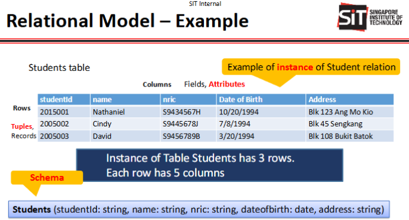

## Relation Data Model

- a db is a collection of one or more relations
- each relation is a table with rows and columns
- simple data representation
- enable users to express queries easily

Stages of db design
1. Requierment analysis
2. Conceptual db design
3. logical db design
4. refining schema
5. physical db design
6. application and security design

Requierment analysis
- understand what data needs to be stored
- what kind of applications uses the data
- what operation need to be performed

conceptual db design
- high-level description of the dara
- constraints to be modeled
- use ER model first
- turns into schema

logical db design
- choose DBMS to use
- convert ER into relational db schema

refining schema
- analyze schema, ID potential problems, refine
- use db theory for normalisation

physical db design
- consider typical workload
- refine design to meed performance req
- build indexes on table
- cluster some tables

application and security design
- identify parts of the db, what accessible, what not accessible
- ensure access rules

## ER model

- conceptual db design
- abstract
- high-level model
  - allow stakeholders to visualise/discuss
  - provide foundation to design database schema

design choices for er:
  - modeling concept as entity, attribute or relationship?
  - what type of relation? constraints?

ER is subjective
  - often many way to model when given req
  - analyzing alternative can be tricky
  - ask qns, clarify with client
  - ER is important pre-step before developing schema

ER terminology/definitions
- entity
  - abstract object of some sort
- Entity set
  - collection of similar entities
- attributes
    - Properties of entities in an entity set
- keys to relations
  - Minimal set of attributes whose values uniquely identify an entity in the set
- relationship
    - connection among 2 or more entity sets
- relationship set
  - collection of similar relationships
- ER diagram:
  - Graph representing entity sets, attributes and relationships
- instances
  - snapshot of set of relationships

ER diagram notation:  
Entity set: rectangle
Attribute: Oval, w/ line to rectangle representing entity set
Key attribute: underline attribute name
Relationship: Diamond, w/ lines to each entity set involved, connects 2 or more entity set

Same entity set could participate in differet relationship sets
Multi-way / ternary relationships connect to more than 2 entity sets  

Relationship with key constraints, arrow shows constraint (like dependant)  
e.g. arrow from Departments entity point to Manages relation. Employees has line to Manages. Means there is an employee who manages the department

## Relations and constraint examples  

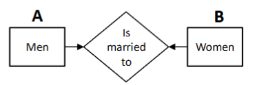

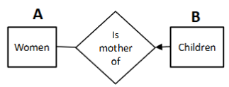

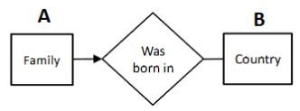

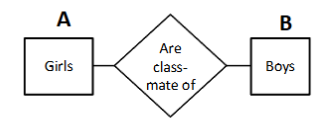

## Converting ER diagram into Relational db

Entity set becomes schema  
- each tuple/row represent 1 entity  
- each tuple/row composed of attributes and has the smae primary key as other tuples/rows
  - 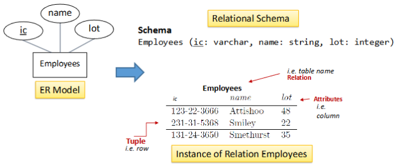

Relations also become table
- must contain primary key from each participating entity set
- must contain all attributes of relationship
- primary key of relation is combination of primary keys of all participating entities
  - 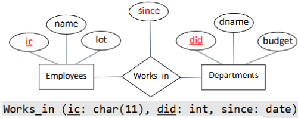
- for relationship back to same entity set, define difference in primary key by the name, e.g. supervisor IC vs subordinate IC
  - 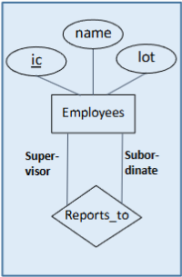
  - 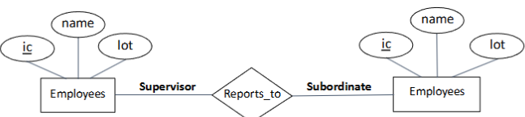
- for relation with constraint, use constaint entity primary key as primary key for relation
  - 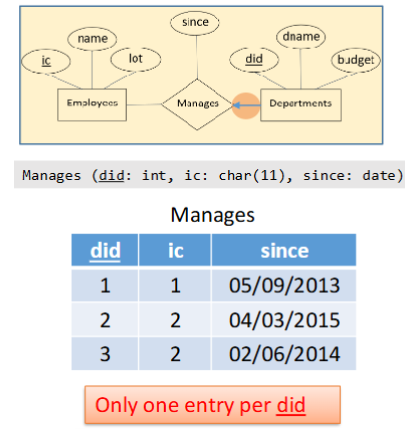
- for relation with constraint merged with constrained entity to form one table. e.g. each department has unique manager, combine Manages into Department
  - 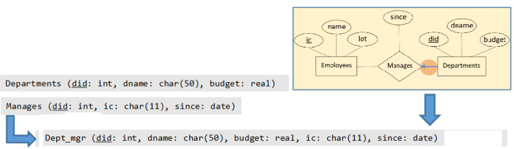

## Relational Queries

relational modle supports simple, querying of data

dbms responsible for effecient evaluation/execution

Query:  
input and output are both relations  
evaluated using instances of each input relation  
produces instance of output relation  

## Structured Query Language (SQL)

most widely used commercial relation database modek  
developed by IBM  
High level lang: says what to do, not how to do it, avoids data-manipulation details  
DBMS to find out most effecient way to exec, called query optimisation

SQL statements:  
CREATE  
INSERT  
SELECT  
Nested queries

### CREATE  
CREATE TABLE table-name (  
    attribute-name1, attribute-type1,  
    attribute-name2, attribute-type2,  
    ...  
    attribute-name-n, attribute-type-n,  
    PRIMARY KEY (attribute-name [,attribute-name2,...])  
    [FOREIGN KEY (some-attribute-name) REFERENCES other-table-name(some-attribute-name), ]  
    [FOREIGN KEY (some-attribute-name) REFERENCES other-table-name(some-attribute-name) ]
    );
- [] is optional statements

Creates relation (aka table)  
type of each field defined in instruction, enforced by DBMS  
PRIMARY KEY uniquely identifies each record in a table  
PRIMARY KEY must contain unique values, cannot be NULL  
Table can have only 1 primary key, which may consist of a single or multiple fields  

FOREIGN KEY used to link 2 tables together.  
FOEREIGN KEY is a field or collection of fields in one table that refers to the primary key of another table  
Table w/ FOREIGN KEY = child table / referencing table  
Table w/ PRIMARY KEY = parent table / referenced table  

FOREIGN KEY constraint:
- prevents actions that would destroy link between tables  
    - deleting attributes / tuple  
- prevent invalid data from being inserted into foreign key column  
    - Cannot insert as value has to exist in parent table
    - Would return FAIL/ERROR if attempted  

enforced FOREIGN KEY constraints = referential integrity

if attempt to insert non-existent parent id into child table: reject  
if attempt to delete row / update row in parent table, got 3 option:  
- deny deletion  
- Delete/update all child rows that refer to this row  
- set FOREIGN KEY of child rows to refer to something else (like a default row)  

### INSERT  

Add (tuples / rows) to (relation / table)  

INSERT INTO table-name  
    (attribute-name1, attribute-name2,...,attribute-name-n)  
VALUES  
    (attribute-value1, attribute-value2,...,attribute-value-n)[,]  
    [(attribute-value1, attribute-value2,...,attribute-value-n)]

### SELECT  

SELECT column1[, column2, ... , column-n]  
FROM table-name  
[WHERE some-condition];  

SELECT DISTINCT column1[, column2, ... , column-n]  
FROM table-name;  

SELECT *  
FROM table-name;  

used to retrieve data from tables  
data returned stored in a result table, called the result-set  
column1, column2 are column names of table you want to select from  

to ommit duplicate data (e.g. find unique test scores), use DISTINCT  
to select all, use *  
to add condition, use WHERE

available operations for WHERE:  
- Boolean
  - AND
  - OR
  - NOT
- Comparisons
  - =
  - <> / !=
  - <
  - >
  - <=
  - >=
  - BETWEEN (between certain range)
  - LIKE (search for pattern)
  - IN
    - specify multiple possible values for a column
    - tests whether a value is in a given set/table

e.g. usage  
S is shortcut for Sailors table, R is shortcut for Reserves table  
Shortcut must be defined when calling table names

SELECT  S.sname  
FROM    Sailors S, Reserves R
WHERE   S.sid = R.sid;  

### Nested queries

WHERE clause can contain SQL query  
executed inner query first as need to have data to check WHERE clause

e.g.  
query 1a and 1b produce same result
query 2a and 2b produce same result

query 1a
SELECT  S.sname  
FROM    Sailors S
WHERE   S.sid IN (SELECT  R.sid
                  FROM    Reserves R
                  WHERE   R.bid = 103);  

query 1b
SELECT  S.sname  
FROM    Sailors S, Reserves R
WHERE   S.sid = R.sid and R.bid = 103;

query 2a  
SELECT  R.sid  
FROM    Reserves R, Boats B
WHERE   R.bid = B.bid AND B.color = 'red';

query 2b  
SELECT  R.sid  
FROM    Reserves R, Boats B
WHERE   R.bid IN (SELECT  B.bid
                  FROM    Boats B
                  WHERE B.color = 'red');