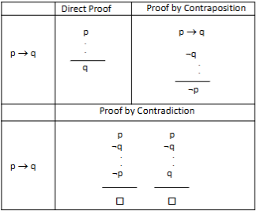
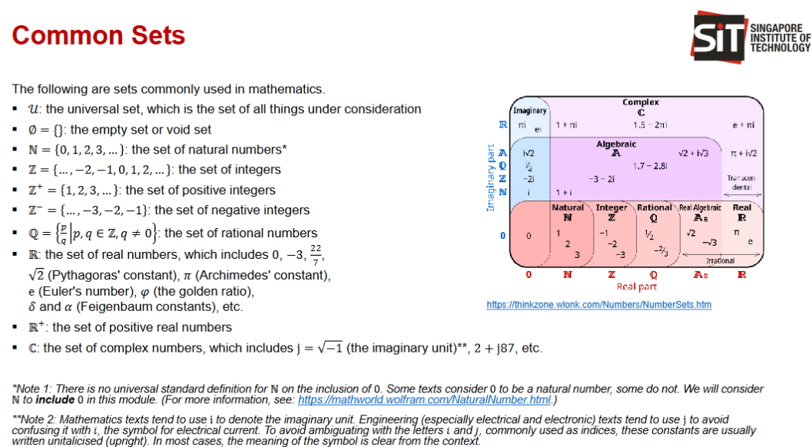
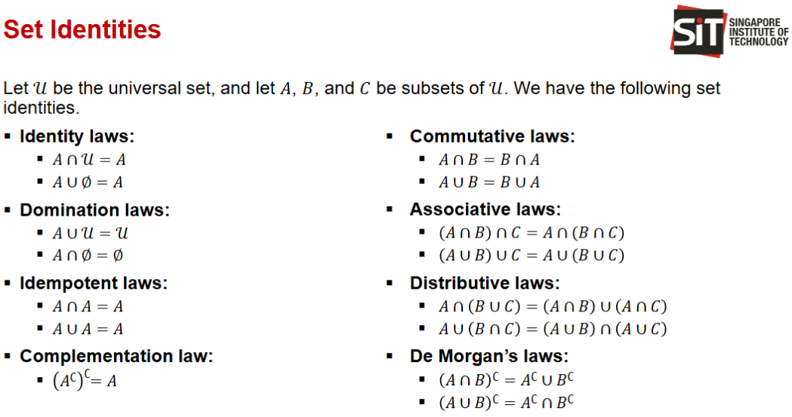
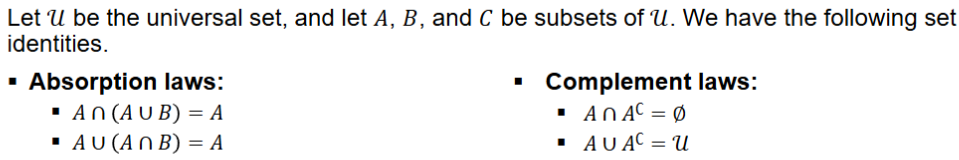

# Topic 1 Sequences

Sequences are ordered and may be infinite
- $(a_1,a_2,a_3,...)$

$a_n$ is a number  
$_n$ is the index

## Other Notation
- $∞$: infinity  
- $∈$: “is an element of”  
- $ℕ$ = 0, 1, 2, 3, ... : the set of natural numbers*  
- $ℤ$ = ... , −2, −1, 0, 1, 2, ... : the set of integers  
- $ℤ^+$ = 1, 2, 3, ... : the set of positive integers  
- $ℤ^−$ = ... , −3, −2, −1 : the set of negative integers  

if notation has subscript, 

## Important Formula

Number of terms  
for $\displaystyle\sum_{k=1}^5$, there are 5 terms,  
for $\displaystyle\sum_{k=0}^4$, there are also 5 terms  

to find num of terms for$\displaystyle\sum_{k=n}^p$: $$p-n+1$$
 

Arithmetic Series Summation  
General formula:
$$a_n = a+(n-1)d$$
Summation formula:
$$S_n = \frac{n[2a+(n-1)d]}{2}$$
$$= \frac{n(a_1+a_n)}{2}$$

Geometric Series Summation  
General Formula: 
$$a_n = ar^{n-1}$$
Summation Formula:  
$$S_n = \frac{a(1 - r^n)}{1 - r}$$
$$ = \frac{a(r^n)-1}{r-1} $$

Infinite Summation 
$$S_∞=\frac{a}{1-r},\ \ \ \ when |r|<1,$$
$a$ is the first element in the sequence,  
$r$ is the ratio

## Recurrance relation

find out next element based on previous element

$$a_n = a_{n-1} [operand] [something]$$

Explicit (General) Formula: reflecting the correlation between term value and its index
$$a_n = f(n)$$

Reursive formula: reflecting the correlation between term value and the value(s) of prior term(s)
$$a_n =f(a_{n-1}),\ \ \  assuming\ (n>1)\ and\ a_1\ is\ given$$
Recurrance relations can use any operand.  
Only important part is that to find $a_{n+1}$, must use $a_n$ and cannot use $_n$

## Series Formula

able find any element based on index  
got 2 kinds, arithmetic and geometric

## Arithmatic Progression

is a sequence of numbers where the **difference** between 2 consective terms is the same

is a sequence with first term a and common difference d
has its terms given by a formula
e.g.  
$$a_n = a+(n-1)d$$

e.g. sequence is 5, 8, 11, 14

## Geometric Progression

is a sequence of numbers where the **ratio** between consecutive terms is the same

is a sequence with first term and common ratio 
has its terms given by a formula  
$$a_n = ar^{n-1}$$

## Summation
$\displaystyle\sum_{k=m}^n a_k = a_m + a_{m+1} + ... + a_n$  

when m=1, often use:  
$S_n = \displaystyle\sum_{k=1}^n a_k$

additivity:  
$\displaystyle\sum_{k=m}^n a_k + \displaystyle\sum_{k=m}^n b_k = \displaystyle\sum_{k=m}^n (a_k+b_k)$  
 
homogenity:  
$\displaystyle\sum_{k=m}^n ca_k = c\displaystyle\sum_{k=m}^n a_k$

**Arithmetic Series Summation**
$$S_n = \frac{n[2a+(n-1)d]}{2}$$
$$= \frac{n(a_1+a_n)}{2}$$

**Arithmetic Summation Application:**

Sum of all positive int $1\leq i \leq 100$  
$S_n = a_1 + ... + a_{100}$  
$= \frac{n[a_1+a_{100}]}{2}$  
$= \frac{100[1+100]}{2}$  
$= 5050$

**Geometric Series Summation**  
when n < ∞ : $$S_n = \frac{a(r^n-1)}{r-1}$$

when n approach ∞:
$$lim_{n->∞},\ \ \ S_n = \frac{a}{r-1}$$

**Geometric series summation application:**  

Investor adds $P$ dollars to an account at the beginning of each year.  
Interest rate $k$ paid at the end of the year  
At beginning of 2nd year, account will have $P(1+k)+P$
At yeat $t$, account will have $P + P(1+k) + ... +P(1+k)^{t-1}$  
  
Value when $t=50, P=100,k=0.01$:
$$S_t = \frac{P[(1+k)^t-1]}{(1+k)-1}$$
$$= \frac{P[(1+k)^t-1]}{k}$$
$$= \frac{100[(1+0.01)^50-1]}{0.01}$$
$$= \$6,446.32$$

## Series , Infinite Summation

Infinite Summation 
$$S_∞=\frac{a}{1-r},\ \ when \ |r|<1,$$
$a$ is the first element in the sequence,  
$r$ is the ratio

**Infinite Summation Application**

$S_∞ = \displaystyle\sum_{n=1}^∞ \frac{1}{3^n}$  
Since exponent in denominator, take out and put in brackets  
$S_∞ = \displaystyle\sum_{n=1}^∞ (\frac{1}{3})^n$  
This makes $\frac{1}{3}$ the ratio.  
So, using Geometric Series summation formula:  
$S_∞ = \frac{\frac{1}{3^1}}{1-\frac{1}{3}} = \frac{\frac{1}{3}}{\frac{2}{3}} = \frac{1}{3}*\frac{3}{2} = \frac{1}{2}$

# Topic 2 Number Theory

Purpose: Cryptography  
based on: factoring int into prime factor is hard  
$n = p*q$ where $p$ and $q$ are distinct primes

RSA = Rivest, Shamir adleman  
key length = 1024 - 4096 bits  
- in 2003 estimated 1024 RSA crackable by 2010  
- no evidence yet but minimum recommendation to use at least 2048 RSA

greatest common demoninator (gcd)

1. choose $p$ and $q$, find $n = p*q$
2. choose $e$ such that $gcd(e,(p-1)(q-1)) = 1$
3. solve $d*e == 1(mod(p-1)(q-1))$
4. pub key: ( e, n ), priv key: ( p, q, d )

in number theory,  
mod is modulo which is % in python  
not modulus where is absolute value |x|

## Key formulae

$$a = d*q +r$$
$$r = a \mod d$$

if $a ≡ b \mod m$ and $c ≡ d \mod m$:  

$$a + c ≡ b + d \mod m$$

$$a*c = b*d \mod m$$

given int $I$ and trying see if prime:  
largest number to check shld be $\sqrt{I}$

$$LCM = \frac{a * b}{GCD}\ \ \ \ OR\ \ \ \ GCD = \frac{a * b}{LCM}$$

## Division

a != 0  
a divides b means $\frac{b}{a}$ no remainder  
a does not divide b means $\frac{b}{a}$ have remainder

$$a = d*q+r$$
 a is dividen, d is divisor, q is quotient, r is remainder

## Division Algorithm

let $a$ be integer, $d$ be +ve integer.  
let $q$ and $r$ be unique with $0 <= r < d$

formula is thus

$$a = d*q +r$$
$$r = a \mod d$$

## Modular Arithmetic

≡ triple bar means congruent

$a ≡ b \mod{m}$  
is same as  
$a \mod{m} = b \mod{m}$

**Theorem**  
- let $m$ be +ve int  
- if $a ≡ b \mod{m}$ and $c ≡ d \mod{m}$
- then  
- $$a + c ≡ b + d (\mod{m})$$
- and  
- $$a*c = b*d (\mod{m})$$

Other equations:
- $(a+b)\mod{m} = ((a\mod{m})+(b\mod{m}))\mod{m}$
- $(a-b)\mod{m} = ((a\mod{m})-(b\mod{m}))\mod{m}$
- $(a*b)\mod{m} = ((a\mod{m})*(b\mod{m}))\mod{m}$
- $a^b\mod{m} = (a\mod{m})^b\mod{m}$

$98 \mod{97} = 1$  
$9800 \mod{97} ≡ 100 \mod{97} = 3$  
$98^5 \mod{97} ≡ 98 \mod {97} = 1$  
$10001 \mod{97} ≡ 301 \mod{97} ≡ 10$

## Primes

**Define prime**  
$p > 1$ and only positive factor is 1 and p  
if int $> 1$ and not prime, is a composite

**Theorem**  
every int $> 1$ can be written uniquely as a prime or as a product of 2 or more primes, where prime factors are written in order of non-decreasing size

**Theorem**  
if $n$ is composite int,  
then n has prime divisor $\leq \sqrt{n}$

^ can use theorem to check is num is prime, using brute force method called trial division
divide n by all primes no exceeding $\sqrt n$  
can conclude n is prime if n no divisible by any of these primes

**Theorem**  
there are infintely many primes

## Greatest common Divisor

GCD is the largest integer that divides 2 integers

let $a,b$ be int, non-zero  
largest int $d$ such that $d$ divides $a$ and $d$ divides $b$  
$d$ is therefore the GCD, denoted as $gcd(a.b)$

if $gcd(a, b) =1$  
$a$, $b$ are relatively prime  
e.g. 17 and 22 relatively prime but 22 is not actual prime

integers in set $a^1,a^2,...,a^n$ are pairwise relativly prime if  
$gcd (a^i, a^j) = 1$  when   $1 <= i < j <= n$  
e.g. determine if 10, 17 and 21 are pairwise relativly prime  
$gcd(10,17) =1$  
$gcd(10,21) =1$  
$gcd(17,21) =1$  
thus they are pairwise relatively prime

suppose prime factorisation for +ve int a and b

$a = p_1^{a1},p_2^{a2}, ... ,p_n^{an}$  
$b = p_1^{b1},p_2^{b2}, ... ,p_n^{bn}$  

then, gcd(a,b) is given by  
$gcd(a,b) = p_1^{min(a1,b1)},p_2^{min(a2,b2)}, ... ,p_n^{min(an,bn)}$  
where $min(x,y)$ chooses the smaller of $x$ and $y$

## Least Common Multiple

Least Common Multiple LCM of positive int $a$ and $b$ is smallest possible int that is divisible by both $a$ and $b$  
denoted as $lcm(a.b)$

suppose prime factorisation for +ve int a and b

$a = p_1^{a1},p_2^{a2}, ... ,p_n^{an}$  
$b = p_1^{b1},p_2^{b2}, ... ,p_n^{bn}$  

then, lcm(a,b) is given by  
$gcd(a,b) = p_1^{max(a1,b1)},p_2^{max(a2,b2)}, ... ,p_n^{max(an,bn)}$  

where $max(x,y)$ chooses the larger of $x$ and $y$

$a,b$
$gcd(a,b) * lcm(a,b) = ab$

## Euclidian Algorithm

### Lemma

Let $a = dq+r$  
where $a$, $d$, $q$ and $r$ are int,  

Then, $$gcd(a,d) = gcd(d,r)$$  

lemma above gives us a more efficient method of finding the greatest common divisor,
called the Euclidean algorithm.  

To find gcd(287,91), divide 287 by 91

$$287 = 91 * 3 +14$$

Then lemma says

$$gcd(287,91) = gcd(91,14)$$

now divide 91 by 14

$$91 = 14 * 6 + 7$$

Then lemma says

$$gcd(91,14) = gcd(14,7)$$

now divide 14 by 7

$$14 = 7 * 2 + 0$$

Thus, $gcd(14,7) = 7$  

Therefore,

$$gcd(287,91) = gcd(91,14) = gcd(14,7) = 7$$

## Extended Euclidian Algorithm

Express $gcd(252,198)$ as $252s + 198t$, for some int $s$ and $t$

$$252 = 198*1+54\tag{1}$$

$$198 = 54*3 +36\tag{2}$$

$$54 = 36*1 +18\tag{3}$$

$$36 = 18*2\tag{4}$$

Hence, $gcd(252,198) = gcd(36,18)=18$  

Rearrange (3) so remainder is the subject

$$18 = 54+(-1)(36)$$

sub in the rearranged (2) into the correct pos at 36

$$= 54+(-1)(198+(-3)(54))$$

simplify

$$=(-1)(198)+4(54)$$

sub in the rearranged (1) into the correct pos at 54

$$=(-1)(198)+4(252+(-1)(198))$$

simplify

$$=4(252)+(-5)(198)$$

Hence,

$$s=4, t=-5$$

$$gcd(252,198) = 252(4) + 198(-5)$$

# Topic 3 Combinatronics

Counting and set theory  

## Important Formulas

$$n_1n_2$$

$$n_1 +n_2$$

$n_1 + n_2$ - (ways common to $n_1$ and $n_2$)

$$|A_1 \cup A_2 |= |A_1| + |A_2| - |A_1 \cap A_2|$$

$$\frac{n}{d}$$

$$_nP_r =\frac{n!}{(n-r)}$$

$\frac{N}{k}$, (round up to closest integer)

## Product Rule

Task1 got $n_1$ ways to do.  
For each way in $n_1$, there are $n_2$ ways to do task2.  
Thus, there are $n_1n_2$ ways to do task1 then task2

Use cases, when positions are limited and cannot repeat positions, e.g. offices/remove from limited pool

## Sum Rule

Task got $n_1$ ways of doing or $n_2$ ways of doing.  
None of $n_1$ is same as $n_2$, i.e. mutually exclusive  
Ways to do task = $n_1 +n_2$

Use case, when only 1 "victor" e.g. elect 1 president. 8 males, 5 females, total options 13

## Subtraction Rule

Task can be done in either $n_1$ or $n_2$ ways or both.  
Ways to do task = $n_1 + n_2$ - (ways common to $n_1$ and $n_2$)  
$$|A_1 \cup A_2 |= |A_1| + |A_2| - |A_1 \cap A_2|$$

use case, total 350, 220 in CS, 147 in business, 51 dual major in CS and business, find non-cs non-business

## Division Rule

Task can be done $n$ ways  
For evey way $w$, there are exactly $d$ ways in $n$ that correspond to way $w$ (basically copies due to conditions)  
Then, there are $\frac{n}{d}$ ways to do the task

use case, conditional sequence, e.g. seating next to specific neightbours at square table  
here you rotate clockwise is new arrangement but still same neighbour

## Permutation

define:  
a permutation of a set of distinct objects is an **ORDERED** arrangement of these objects.  
An ordered arrangement of r elements of a set is called an r-permutation (where $r < len(set)$)

e.g.:  
$S = \{1,2,3\}$

Ordered arrangement $(3,1,2)$ is a permutation of S  
Ordered arrangement $(3,2)$ is a 2-permutation of S  

number of $r$-permutations of a set with $n$ elements is denoted by $P(n,r),\ \ ^nP_r,\ \ _nP_r$
$$_nP_r = n(n-1)(n-2)...(n-r+1)$$
$$=\frac{n!}{(n-r)}$$

$_nP_0=1$ whenever n is a non-negative integer since only one way to order 0 elements

1st 2nd 3rd place, 100 contestants  
how many ways to choose winners  
(can be seen as product rule or as permutations)
$_{100}P_3 = 100*99*98 = 970\ 200$

## Combinations

An $r$-combination of a set is an **UNORDERED** selection of $r$ elements from the set.  
Thus, an $r$-
combination is simply a subset of the set, with the subset having $r$ elements.

$S=\{1,2,3,4\}$
$\{1,3,4\}$ is a 3-combination from $S$
$\{4,1,3\}$ is the **SAME** 3-combination, since unordered

Notation:  
$r$-combinations of a set with $n$ distinct elements is denoted by:  
$C(n,r),\ \ ^nC_r,\ \ _nC_r,\ \ (^n_r)$

Theorem:  
number of $r$-combinations of a set with $n$ elements, where $n$ is a non-negative integer and $r$ is an integer with $0\leq r\leq n$ is
$$_nC_r = \frac{n!}{r!(n-r)!}$$

Corollary  
let $n$ and $r$ be non-negative integers with $r\leq n$  
Then, $_nC_r = _nC_{n-r}$  
Thus,
$$_nC_r = \frac{n!}{r!(n-r)!}$$
$$= _nC_{n-r}$$

## Pigeonhole principle

Theorem:  
If $k+1$ or more objects are placed into $k$ boxes, then there is at least 1 box containing 2 or more objects  

E.g.  
Group of 367 people, must be at least 2 with same birthday, since only 366 possible birthdays  
In any group of 27 English words, must be at least 2 that begin with the same letter

## Generalised Pigeonhole principle

Theorem (generalised Pigeonhole principle):  

If $N$ objects placed into $k$ boxes, then there is at least 1 box containing at least $\lceil\frac{N}{k}\rceil$ objects  
$\lceil\rceil$ is ceiling round, round up to nearest integer

e.g. 6 computers in network, all connected to at least 1 other computer.  
Show there are at least 2 computers that have the same number of connections.  
"Holes" are num connections: 1,2,3,4,5  
"Pigeons" are computers  
$N=6,\ k=5$  
$\lceil\frac{6}{5}\rceil=2$

e.g. How many students in class to ensure 6 students get same grade out of (A,B,C,D or F)  
$\lceil\frac{N}{5}\rceil=6$  
$6\leq\lceil\frac{N}{5}\rceil<\frac{N}{5}+1$  
$6\leq\frac{N}{5}+1$  
$5\leq\frac{N}{5}$  
$25\leq\N$  
Ans: $26$

# Topic 4 : Propositional Logic

aka Propositional Calculus or Zeroth-Order Logic

dealing with true or false propositions and logical connectives 
forms compound propositions.

sentance must be a declaration. Even if declaration is wrong, it is still a proposition.  
E.g. 2+2 = 3

sentances that are not declarations cannot be propositions.  
E.g. How old are you?

--------------

## Notation

use letters to denote propositional variables or statement variables  
conventional letters used for propositional variables are $p, q, r, s, ...$

⊤ or T: proposition is true, (Known as a “tee”, “downtack”, or “verum” symbol.)

⊥ or F: proposition is false, (Known as an “up tack” or “falsum” symbol.)

¬ or -: negation, NOT gate

∧: called "wedge", conjuction, AND gate

∨: called "vee", disjuction, OR gate

⊻ or ⊕: Exclusive disjunction, XOR gate

→ or ⇒: Imply, Material Conditional

⇔ or ↔: Material Biconditional, NOT XOR gates

Let $p$ and $q$ be propositions.  
The proposition $q → p$ is the **converse** of $p → q$.  
The proposition $¬q → ¬p$ is the **contrapositive** of $p → q$.  
The proposition $¬p → ¬q$ is the **inverse** of $p → q$.  

**Converse** : swap left and right hand sides
**Contrapositive** : swap left and right hand sides, NOT both sides
**Inverse** : NOT both sides

**Precedence of logical connectives**  
1. Rule 1: The negation operator (¬) is applied before all other logical operators.
   - So, $¬p ∧ q$ means $¬(p) ∧ q$.  
2. Rule 2: The conjunction operator (∧) takes precedence over the disjunction operator (∨).
   - So, $p ∧ q ∨ r$ means $(p ∧ q) ∨ r$, rather than $p ∧ (q ∨ r)$ .  
3. Rule 3: The material conditional and biconditional operators (→ and ⇔) have lower
precedence than the conjunction ∧ and disjunction ∨ operators.
   - So, $p → q ∨ r$ means $p → (q ∨ r)$ 

|Connective            |Operator|Precedence|
|:---------------------|:------:|:--------:|
|Paranthesis|||
|Quantifiers|||
|Negation              |   ¬    |     1    |
|Conjunction           |   ∧    |     2    |
|Disjunction           |   ∨    |     3    |
|Material Conditional  |   →    |     4    |
|Material Biconditional|   ⇔   |     5    |

XOR between 2 and 3, no universal standard  
if needed in exam, prof will write into the qn when to do XOR

OTHER USEFUL EQUIVALENCES

- Equivalences involving conditionals:
- - $$p → q ≡ ¬q → ¬p$$(Proposition–Contrapositive; or Converse–Inverse)
- - $$p ∨ q ≡ ¬p → q$$
- - $$p ∧ q ≡ ¬(p → ¬q)$$
- - $$¬(p → q) ≡ p ∧ ¬q$$
- Equivalences involving biconditionals:
- - $$p ⇔ q ≡ (p → q) ∧ (q → p) ≡ ¬p ⇔ ¬q ≡ (p ∧ q) ∨ (¬p ∧ ¬q)$$
- - $$¬(p ⇔ q) ≡ p ⇔ ¬q ≡ p ⊕ q$$

---------------

## Propositions

aka Boolean Statements

proposition is a declarative sentence.
declares a fact that is either true or false, but not both.

--------------

### Negation:

Logic gate: NOT

Let $p$ be proposition.  
The negation of $p$, denoted by $-p$, is the statement that the proposition $p$ is false.  
read as "not p"

¬: special NOT symbol

be careful when interpreting propositions, dont over interpret
E.g.  
p = Vandana’s smartphone does not have at least 32 GB of memory.
¬p should be: Vandana’s smartphone **does** have at least 32 GB of memory.
It should not be: Vandana’s smartphone **does** have **more than** 32 GB of memory.

------------------

## Connectives

### Conjuction

Logic gate: AND

Let $p$ and $q$ be propositions.  
The conjunction of $p$ and $q$, denoted by $p ∧ q$, is the proposition “$p$ and $q$”.  
∧: called "wedge"

ways to say:
- and
- but, e.g. p but not r = p and not r
- nevertheless e.g. not p nevertheless, r = not p and r
------------------

### Disjunction

Logic gate: OR

Let $p$ and $q$ be propositions. 
The disjunction of $p$ and $q$, denoted by $p ∨ q$, is the
proposition “p or q”.  
∨: called "vee"

------------------

### Exclusive Disjunction

Logic gate: XOR

Let $p$ and $q$ be propositions. 
The disjunction of $p$ and $q$, denoted by $p ⊻ q$ or $p ⊕ q$ or $p ^ q$, is the
proposition “p exclusive or q”.

------------------

### Material Conditional

Logic gate: IMPLY

Let $p$ and $q$ be propositions.  
The material conditional or material implication, denoted as "$p → q$" or "$p ⇒ q$", is the proposition “if p, then q” or “p implies q”.  

asserts that $q$ is true on the condition that $p$ holds.
**Note**: when $p$ is false, then $p → q$ is true, regardless of the truth value of $q$.

if left hand side true (antecident true) but right hand side (consequence false)

| p | q |$p → q$|
|---|---|-------|
| F | F |   T   |
| F | T |   T   |
| T | F |   F   |
| T | T |   T   |

The Many ways to say $p → q$:
- “if $p$, then $q$”;
- “when/whenever $p$, $q$”;
- “$p$ implies $q$”;
- “$p$ only if $q$”;
- “a sufficient condition for $q$ is $p$”;
- “$q$ is necessary for $p$”;
- “a necessary condition for $p$ is $q$”;
- “$q$ unless not $p$”
- “unless not $p$, $q$”
- “$p$ is sufficient for $q$”;

NOT examples on how to say:
- “$q$ when/whenever $p$”;
- if $q$, will $p$
- if $q$, $p$ will happen

Material Conditional example:  

-----------------
Example 1:  
Consider the following statement: “If it rains, then I will remain indoors.”  
If indeed it rains, then you will expect to find me indoors.  
However, if it does not rain, it does not mean that I have to go outside. I have the option of
either remaining indoors or going outside, when it does not rain.

***Fr guys, just write out a whole truthtable***
"Me taking notes is necessary for me to score an A grade in the module."
Correct ans is :
$p$ = score an A grade
$q$ = took notes

"if $p$ then $q$" or "if $p$, it implies $q$"

WRONG ANS  
if $q$, i will $p$ -----> wrong since you can also score A and not take notes, smarty-pants

Truth Table:  

| got A Grade? | took notes? | if got A grade, implies took notes|
|:------------:|:-----------:|:----------------------------------------------:|
|      No      |      No     |Bum never study, maybe which we treat as true   |
|      No      |     Yes     |L very unfortunate, maybe which we treat as true|
|      Yes     |      No     |HUH HOW!? this guy cheating fr.  PROVES FALSE   |
|      Yes     |     Yes     |Proves proposition right, of course True lah    |

---------------------------

Example 2:  
Consider the conditional statement “If I perform well, I will not get a pay raise”.  
What are the converse, the contrapositive, and the inverse of this statement?  

Let $p$ be the proposition “I perform well”;  
Let $q$ be the proposition “I get a pay raise”.  
Thus $¬q$ is "I do not get a pay raise"

Better to do truth table  

| perform well? | didnt get a raise? |I perform well, I will not get a pay raise|
|:-------------:|:------------------:|:---------------------------------------:|
|       No      |         No         | Bum what you expect. Maybe i.e. true|
|       No      |        Yes         | Maybe you SAF encik and you hit timelimit. Maybe i.e. true|
|       Yes     |         No         |  OI IN WHAT UNIVERSE!? PLEASE ISEKAI ME THERE   |
|       Yes     |        Yes         | Proves proposition right, of course True lah|

------------------

### Material Biconditional

Logic Gate: XNOR

Let $p$ and $q$ be propositions.  
The material biconditional or material bi-implication, denotaed as "$p ⇔ q$" or "$p ↔ q$", is the proposition “$p$ if and only if $q$”.  
The material biconditional $p ⇔ q$ is true when p and q have the same truth values; and false otherwise.  

Note that $p ⇔ q$ is true when both the material conditionals $p → q$ and $q → p$ are true;
otherwise, it is false.

Thus, we can say "if and only if" for this connective.  
Other ways to say:  
- $p iff q$ (yes it is **iff**, not if)
- $p$ is a necessary and sufficient condition for $q$
- $q$ if and only if $p$ 

|$p$|$q$|$p ⇔ q$|
|---|---|--------|
| F | F |   T    |
| F | T |   F    |
| T | F |   F    |
| T | T |   T    |

Derivation of truth table above
| p | q |$p → q$|$q → p$|$(p → q) ∧ (q → p)$|
|---|---|-------|-------|-------------------|
| F | F |   T   |   T   |         T         |
| F | T |   T   |   F   |         F         |
| T | F |   F   |   T   |         F         |
| T | T |   T   |   T   |         T         |

-------------

### Converse, Contrapositive, Inverse

Let $p$ and $q$ be propositions.
The proposition $q → p$ is the **converse** of $p → q$.
The proposition $¬q → ¬p$ is the **contrapositive** of $p → q$.
The proposition $¬p → ¬q$ is the **inverse** of $p → q$.

**Converse** : swap left and right hand sides
**Contrapositive** : swap left and right hand sides, NOT both sides
**Inverse** : NOT both sides

Note:  
Only the **contrapositive** has the **same truth table** as $p → q$  
Truth tables of the **converse** and **inverse** are  the same.

REMINDER: Not all propositions are true. BUT they are still propositions nonetheless

Example:

----------------
This a bit tricky  
This is a Material conditional statement  
Consider the conditional statement “The home team wins whenever it is raining”.  
What are the converse, the contrapositive, and the inverse of this statement?  

Let $p$ be the proposition “it is raining”;  
Let $q$ be the proposition “the home team wins”.  

Better to do truth table  

| is raining | home team winning? |The home team wins whenever it is raining|
|:----------:|:------------------:|:---------------------------------------:|
|     No     |         No         |Does not prove or disprove this, basically maybe which we treat as true|
|     No     |        Yes         |Does not prove or disprove this, basically maybe which we treat as true|
|     Yes    |         No         |  PROVES THIS GUY LYING.  PROVES FALSE   |
|     Yes    |        Yes         | Proves proposition right, of course True lah|

Converse, $q$ implies $p$,  
thus, "if $q$ then $p$"
"if $q$ then $p$" is not same as "if $p$ then $q$"  
CONVERSE IS **NOT** THE SAME AS ORIGINAL

CONVERSE Truth table  
"if Home Team Winning, then it is raining"
| is raining | home team winning? |if Home Team Winning, then it is raining|
|:----------:|:------------------:|:---------------------------------------:|
|     No     |         No         |Does not prove or disprove this, basically maybe which we treat as true|
|     No     |        Yes         |Proved proposition false|
|     Yes    |         No         |Does not prove or disprove this, basically maybe which we treat as true|
|     Yes    |        Yes         | Proves proposition right, of course True lah|

Contrapositive, not $q$ implies not $p$,  
If the home team is not wining, then it is not raining.  
- Explanation
- If you see weather is rain, then you know home team win.  
- If you see home team lose, then you know it wasnt raining  
CONTRAPOSITIVE **IS** THE SAME AS ORIGINAL

CONTRAPOSITIVE Truth table  
| is raining | home team winning? |not is raining|not home team winning|If the home team is not wining, then it is not raining|
|:----------:|:------------------:|:-:|:-:|:---------------------------------------:|
|     No     |         No         |Yes|Yes|Proved true|
|     No     |        Yes         |Yes|No |lucky day? maybe|
|     Yes    |         No         |No |Yes|raining and not winning? Proved false|
|     Yes    |        Yes         |No |No |doesnt prove this, maybe i.e. true|

Inverse, not $p$ implies not $q$,
If it is not raining, then the home team does not win.
INVERSE IS **NOT** THE SAME AS ORIGINAL
INVERSE IS THE **SAME AS CONVERSE**

INVERSE Truth table  
| is raining | home team winning? |If it is not raining, then the home team does not win.|
|:----------:|:------------------:|:---------------------------------------:|
|     No     |         No         |Proved true|
|     No     |        Yes         |proved false|
|     Yes    |         No         |Maybe|
|     Yes    |        Yes         |Maybe|

--------------

example  
Classify an arbitrary object.
if shape is square, then shape is rectangle

let $p$ be "shape is square"  
let $q$ be "shape is rectangle"

|$p$|$q$|$p → q$|Reason|
|---|---|-------|------|
| F | F |   T   |arbitrary shape is neither (maybe)|
| F | T |   T   |arbitrary shape is rectangle (maybe)|
| T | F |   F   |arbitrary shape is square and not rectangle (false)|
| T | T |   T   |arbitrary shape is square and rectangle (always true)|

CONVERSE  
if shape is rectangle, then shape is square
|$p$|$q$|$q → p$|Reason|
|---|---|-------|------|
| F | F |   T   |arbitrary shape is neither (maybe)|
| F | T |   F   |arbitrary shape is rectangle but not square (false)|
| T | F |   T   |true because in this case p is true if q. Since q is F, does not matter what p is|
| T | T |   T   |arbitrary shape is square and rectangle (always true)|

## Precedence of logical connectives

1. Rule 1: The negation operator (¬) is applied before all other logical operators.
   - So, $¬p ∧ q$
means $¬(p) ∧ q$.  
2. Rule 2: The conjunction operator (∧) takes precedence over the disjunction operator (∨).
   - So, $p ∧ q ∨ r$ means $(p ∧ q) ∨ r$, rather than $p ∧ (q ∨ r)$ .  
3. Rule 3: The material conditional and biconditional operators (→ and ⇔) have lower
precedence than the conjunction ∧ and disjunction ∨ operators.
   - So, $p → q ∨ r$ means $p → (q ∨ r)$ 

|Connective            |Operator|Precedence|
|:---------------------|:------:|:--------:|
|Negation              |   ¬    |     1    |
|Conjunction           |   ∧    |     2    |
|Disjunction           |   ∨    |     3    |
|Material Conditional  |   →    |     4    |
|Material Biconditional|   ⇔   |     5    |

XOR between 2 and 3, no universal standard  
if needed in exam, prof will write into the qn when to do XOR

## Compound Proposition

compound proposition refers to an expression formed from atomic propositional variables ($p,q,r,s$) using logical connectives (operators).  
Examples representations:

--------
$¬r$
$p ∨ q$
$p ⇔ q$
$(p → q) ∧ (r → p)$
$(r ∧ q) → (r ⊕ p)$

-----------
Examples:

--------------
Construct Truth Table for: $(p ∨ ¬q) → (p ∧ q)$

|p|q|¬q|$p ∨ ¬q$|$p ∧ q$|$(p ∨ ¬q) → (p ∧ q)$|
|-|-|--|--------|-------|--------------------|
|F|F| T|    T   |   F   |         F          |
|F|T| F|    F   |   F   |         T          |
|T|F| T|    T   |   F   |         F          |
|T|T| F|    T   |   T   |         T          |

## Logical equivelence

Compound propositions $P$ and $Q$ are logically equivalent if $P ⇔ Q$ is a tautology (Has identical truth table).  
The notation $P ≡ Q$ denotes that $P$ and $Q$ are logically equivalent.

Example  

--------------
De Morgan laws
Show $¬(p ∧ q) ≡ ¬p ∨ ¬q$ (law 1)
|$p$|$q$|$p ∧ q$|$¬(p ∧ q)$|$¬p$|$¬q$|$¬p ∨ ¬q$|
|---|---|-------|----------|----|----|---------|
| F | F |   F   |    T     |  T |  T |    T    |
| F | T |   F   |    T     |  T |  F |    T    |
| T | F |   F   |    T     |  F |  T |    T    |
| T | T |   T   |    F     |  F |  F |    F    |

Show $¬(p ∨ q) ≡ ¬p ∧ ¬q$ (law 2)
|$p$|$q$|$p ∨ q$|$¬(p ∨ q)$|$¬p$|$¬q$|$¬p ∧ ¬q$|
|---|---|-------|----------|----|----|---------|
| F | F |   F   |    T     |  T |  T |    T    |
| F | T |   T   |    F     |  T |  F |    F    |
| T | F |   T   |    F     |  F |  T |    F    |
| T | T |   F   |    T     |  F |  F |    F    |

-----------

is $p → q ≡ ¬p ∨ q$?

|$p$|$q$|$¬p$|$p → q$|$¬p ∨ q$|
|---|---|----|-------|--------|
| F | F |  T |   T   |   T    |
| F | T |  T |   T   |   T    |
| T | F |  F |   F   |   F    |
| T | T |  F |   T   |   T    |

ans: yes since truth tables identical

-------------------

OTHER USEFUL EQUIVALENCES

- Equivalences involving conditionals:
- - $$p → q ≡ ¬q → ¬p$$ -(Proposition–Contrapositive; or Converse–Inverse)
- - $$p ∨ q ≡ ¬p → q$$
- - $$p ∧ q ≡ ¬(p → ¬q)$$
- - $$¬(p → q) ≡ p ∧ ¬q$$
- Equivalences involving biconditionals:
- - $$p ⇔ q ≡ (p → q) ∧ (q → p) ≡ ¬p ⇔ ¬q ≡ (p ∧ q) ∨ (¬p ∧ ¬q)$$
- - $$¬(p ⇔ q) ≡ p ⇔ ¬q ≡ p ⊕ q$$

## Tautology, Contradiction, Contingency, Satifiability

### Tautology

A compound proposition that is always true, no matter what the truth values of its
propositional variables, is **called a tautology**.

**Always true for all inputs**

-------

### Contradiction

A compound proposition that is always false is called a contradiction.

**Always false for all inputs**

--------

### Contingency

A compound proposition that is neither a tautology nor a contradiction is called a
contingency.

**True for some inputs, False for other inputs**

--------

### Satifiability

A proposition is satisfiable if it is **true under some assignment of values** to its propositional variables.

Satisfied = Value is true (wether through combination of inputs or tautology)
Satisfiable = Value can be made to be true through combination of inputs

Tautologies are satisfiable.
- always satisfied.
- i.e always true for any assignment of values to input.

Contradictions are unsatisfiable.
- never satisfied.
- i.e. always false for any assignment of values to input.

Contingencies are satisfiable.
- can be either satisfied or not satisfied.
- i.e. either true or false depending on input.
- satisfied by some input, unsatisfied by others.
- *Note that contingencies, by definition, are neither tautologies nor contradictions.

Example

--------

𝑝 ∨ ¬𝑝 is a tautology.  
𝑝 ∧ ¬𝑝 is a contradiction.

---------

# Topic 5: Predicate Logic

Predicate Logic: enables concise and general expressions

Statements with variables may not be able to become a proposition.
e.g. $x>4$ or $x=y+3$ or "Every student in my class had submitted at least one assignmnet"

"Every student in my class had submitted at least one assignmnet"  
This sentance requires one proposition per student  
However, can say $P(x) =$ x has submitted an assignment

the subject: x  
the predicate (a property of x): had submitted an assignment

The predicate now represents the whole student set

once $x$ has a value, then can get a truth value

quantifiers have no intrinsic precedence, do left to right  
expect readable English sentance instead of plain translation of quantified predicate  

When all variables in a predicate are given specific values, it becomes a proposition

It is easier to prove an exitental quantifier to be true than false, only need 1 example.

try to eliminnate negation infrom of predicate first

negation outside a quantifier means it can e simplified and is currently not a proposition

## Predicate / Propositional Fucntion

$$S(x): x\ is\ a\ student$$

x is the variable, represent objs from a group/set

S is a predicate, a property that is applied to x

S() is a propositional function, applying the predicate to the variable, itself is NOT a propositions

e.g. of usage  
S(Alice): Alice is a student, aka True
S(Abhishek): Ahbishek is NOT a student, aka False

variables come from a domain, likE a type in programming
e.g. All positive integers, all students in a class

Consider:  
"All students are hardworking"  
"Alice is a student"
Does it follow that: "Alice is hard-working"?

## Quantifiers

Quantifiers in Predicate logic
1. Universal Quantifier, $∀$
   - Truth Value using domain
   - Truth value using counter example
2. Existential Quantifier
   - Truth value using domain

Quantifier with restricted domain
Precedence of Quantifier
Negatin Quantified Expressions
Nested Quantifiers
   - Quantification of two variables

### Universal Quantifier, $∀$

$$∀x\ P(x)$$
$$∀x\ P(x) = P(x_1) ∧ P(x_2) ∧ P(x_3) {...}$$

read as "For all $x$, $P(x)$" or "For every $x$ , $P(x)$" or "Every x in [domain] [predicate]"

e.g.  
Every student in your class has taken a course in python  
Every x in set of positive integers fulfills x > 0

assert property is true for all values of x in particular domain (called domain of discourse / universe of discourse)

The Universal quantification of $P(x)$ for a particular domain is the proposition that asserts that $P(x)$ is true for all values of x in this domain.  
**BUT $∀x\ P(x)$ is NOT a proposition, it is a quantifier. BUT the quantifier can have a truth value**  
can be thought of as a conjunction of all values of x. I.e

$$∀x\ P(x) = P(1) ∧ P(2) ∧ P(3)$$

If one value of P(x) is false, then $∀x\ P(x)$ will be false  

truth value of $∀x\ P(x)$ will change when the domain changes.  
Thus, domain must be specified when universal quantifier is used, otherwise universal quantifier is not defined

### Universal Quantifier, Counter examples

A statement $∀x\ P(x)$ is false, where $P(x)$ is a propositional function, if and only if $P(x)$ is not always true when $x$ is in the domain

$$∀x\ P(x) ↔ P(x)\ for\ all\ x$$

### Existential Quantifier, $∃$

$$∃x\ P(x)$$
$$∃x\ P(x) = P(x_1) ∨ P(x_2) ∨ P(x_3) {...}$$

read as "There exists an $x$, such that $P(x)$" or "For some $x$, $P(x)$"  

**Same as $∀x\ P(x)$, $∃x\ P(x)$ is NOT a proposition, it is a quantifier. BUT the quantifier can have a truth value**  
"There exists an element $x$ in the domain, such that $P(x)$ 

truth value of $∃x\ P(x)$ will change when the domain changes.  
Thus, domain must be specified when Existential quantifier is used, otherwise Existential quantifier is not defined

## Quantifiers, Restricted Domains

in the domain of all real numbers
$$∀x < 0\ (x^2 > 0)$$
$$∀y \neq 0\ (y^3 \neq 0)$$
$$∃z > 0\ (z^2 = 2)$$

in $∀x < 0\ (x^2 > 0)$, the domain is all real numbers where $x < 0$ and the predicate is $(x^2 > 0)$

every non-zero real number y, y^3 is also a non-zero number

there exists a positive real number z such that z^2 = 2

## Logical Precedence of Quantifiers

Both quantifiers have higher precedence than all logical operators  
$$∀x P(x) ∨ Q(x)\ !\equiv ∀x (P(x) ∨ Q(x))$$
$$∀x P(x) ∨ Q(x)\ \equiv (∀x P(x)) ∨ Q(x)$$

## Negating Quantified Expressions

$$¬∀x\ P(x) \equiv ∃x(¬P(x))$$
$$¬∃x\ P(x) \equiv ∀x(¬P(x))$$

E.g.  
"Every student in your class has taken a course in Python."  
P(x) = x has taken a course in Python  
Domain = students in your class
$∀x\ P(x)$
Negate statement = $¬∀x\ P(x)$  
"NOT Every student in your class has taken a course in Python."  
AKA
"There is a student in your class who has not taken a course in Python"  
$∃x(¬P(x))$

"There is a student in your class who has taken a course in Python."  
P(x) = x has taken a course in Python  
Domain = students in your class
$∃x\ P(x)$
Negate statement = $¬∃x\ P(x)$  
"There is NOT student in your class who has taken a course in Python."  
AKA
"Every student in your class has NOT taken a course in Python"  
$∀x(¬P(x))$

$$¬∀x(x^2 > x) \equiv ∃x(x^2 \leq x)$$
$$¬∃x(x^2=2) \equiv ∀x(x^2 \neq 2)$$

## Nested Quantifiers

$∀x∀yP(x,y) \equiv ∀y∀xP(x,y)$

q1. domain is real numbers
$$∀x∃y(x + y = 0)$$
$$\equiv ∀x Q(x), Q(x) = ∃y(x + y = 0)$$

read as "for every real number x, thereis a real number y such that $x + y = 0$"  
i.e. for every real number x, there is an real number y that is the addative inverse of x

q2. domain is real numbers
$$∀x∀y(x + y = y + x)$$

read as "x + y = y + x, for all x and y real numbers"

q3. domain is real numbers
$$∀x∀y((x > 0) ∧ (y < 0) → (xy < 0))$$

read as "for every real number x and for every real number y, if $x > 0$ and $y < 0$, then $xy < 0$

q4.
let $Q(x,y)$ denote '$x + y = 0$'  
What are the truth values of the following:
$$∃y∀xQ(x,y)$$
$$∀x∃yQ(x,y)$$

$∃y∀xQ(x,y)$ = $∃y(∀xQ(x,y))$ = There is a real number $y$ such that for every real number $x$, $x + y = 0$.  
Cannot be true as there is no singular real number $y$ such that $x + y = 0$ every real number $x$

$∀x∃yQ(x,y)$ = $∀x(∃yQ(x,y))$ = For every real number $x$, there is a real number $y$ such that , $x + y = 0$.  
Can be true as tor a given real number $x$, we can choose a real number $y$ such that $x + y = 0$

-----------------------------------------------------------------

# Topic 6 Inference

assume fisrt premis is true unless otherwise stated
if ask for prove, must assume

logical equivalences still apply anywhere before, in between or after rules of inferences

rules of inference only work downwards?

if rule is basically imply, can i use logical equivalences to adapt it?  
e.g. simplification: (𝑝 ∧ 𝑞), ∴p = (𝑝 ∧ 𝑞) → p ?

resolution does not need to have unique variables in premise.  
e.g. resolution (𝑝 ∨ q) and (¬𝑝 ∨ 𝑟) is (∴ 𝑞 ∨ r) BUT SO IS (𝑝 ∨ q) and (¬𝑝 ∨ q) is (∴ 𝑞 ∨ q)

cannot use existential instantiation as input to universal generalisation

for addition rule, p therefore p or q, does q have to be a give premise? or can i just pull it out of my ass?
YES YOU CAN PULL IT OUT OF YOUR ASS, 6.1a inference on xsite says so.

 q → r $\equiv$ ¬q ∨ r (in formula sheet)  
 this formula can be cconsidered a bridge between implication rules of inference (Modus ponens, modus tollens, hypothetical syllogism) and disjunction rules of inference (Disjunctve syllogism, addition, resolution)

arguement:
series of proposition
a number of premise followed by single conclusion
argument is valid if all premise imply conclusion is a tautology
validty does not require premises or conclsion to be true in real world

rules exist for propositional logic and predicate logic

instatiation ules: from pool of valid values to specific val
generalisation rules: specific val to pool of valid ones

validity of arguemnt != truth table.

argument is valid if all premise and conclusion is true. Therefore the argument is a tautology.

if premise is true but caqnnot conclude, argument invalid

you can invalidate an argument by proving a premise false

There is no problem uaing the imply version of proposition or the conjunctive (AND) version since both are equivalent. Use whichever is more helpful to you for that qn

if q = ($a \leq \sqrt{n}$), ¬q = ($a > \sqrt{n}$)

Rules of inference are treated as true and so no need to use the truth tables for each to prove conclusion true. Just use the rule.

Rules of inference only work because each rule is a tautology

Modus Ponens
(p ∧ (p → q)) → q

Modus Tollens  
(¬q ∧ (p → q)) → ¬p

Resolution  
((p ∨ q) ∧ (¬p ∨ r)) → (q → r)

Constructive Dillemma
((p → q) ∧ (r → s) ∧ (p ∨ r)) → (q ∨ s)

# Topic 7 Proofs

Theorem: statment that can be shown to be true.  
AKA facts or results.  
less important theorems somtimes called propositions.  
Theorem may be universal quantification of conditional statement with one or more premises and a conclusion

If qn says: prove p1,p2...pn are equivalent, p1 → p2, p2 → p3, ...

## direct proof:  
step 1 assume p is true  
use rules of inference  
last step show q is true  

## Proof By Contraposition  
(p → q) $\equiv$ (¬q → ¬p)  
so if can prove (¬q → ¬p), (p → q) is proven  
example used this when qn asked abt odd num

## Vacuous Proof  
(p → q) is always true when ¬p.  
so if can show ¬p, (p → q) is proven  
(often used to establish special case in theorems that state a conditional statement for all positive integers)  

## Trivial Proof  
(p → q) is always true when q.  
so if can show q, (p → q) is proven  
(important when special cases of theorems are proved)  

## Proof By Contradiction  
p is true when (¬p → (r∧¬r)), for some proposition r  

Proof By Contadiction example:  (proving statement is true)  
Let p be proposition "$\sqrt{2}$ is irrational"  
Suppose ¬p is true. (i.e. "$\sqrt{2}$ is rational")  
Thus, $\sqrt{2} = \frac{a}{b}$, whereby b!= 0 and a and b have no common factors  
Thus, $2 = \frac{a^2}{b^2}$, meaning $a^2 = 2*b^2$.  
Since $a^2 = 2*b^2$, $a^2$ is even.  
Since $a^2$ is even, $a$ is even  
Since $a$ is even, $a = 2c$ for some integer $c$  
Sub in $a = 2c$ into $a^2 = 2*b^2$, $4*c^2 = 2*b^2$  
Thus $b^2 = 2*c^2$, meaning $b^2$ is even and, thus, $b$ is even  
Since both $a$ and $b$ are even, both have 2 as common factor.  
But is contradiction, since assum have no common factor.  
Thus, ¬p is false, meaning p is true i.e. $\sqrt{2}$ is irrational  

Proof By Contadiction example:  (proving by implication)  
Give proof by contradiction of theorem "If $3n + 2$ is odd, then $n$ is odd"  
p = $3n + 2$ is odd  
q = $n$ is odd  
Statement is $p → q$
To construct Contradiction, $¬(p → q)$  
Which is $¬(p → q) \equiv p ∧ ¬q \equiv ¬(¬p ∧ q)$  
Thus let us assume: $(p ∧ ¬q)$, i.e. p is true, ¬q is true  
Thus assume $3n + 2$ is odd, $n$ is not odd  
Since $n$ not odd, $n = 2k$ for some int k  
Means $3n + 2 = 3(2k) + 2 = 2(3k+1)$, meaning 3n+2 is even. I.e. ¬p  
Since p and ¬p are both true, we have contradiction.

## Proof of Biconditional statement ↔
To prove $p ↔ q$, show $p → q$ and $q → p$ are true  
EXAMPLE  
Prove: "If $n$ is an integer, then $n$ is odd if and only if $n^2$ is odd"  
Theorem is in form of "p if and only if q", where p is "$n$ is odd" and q ia "$n^2$ is odd".  
To prove, need show $p → q$ and $q → p$ are true  
Start with Direct Proof,  
Assume $n$ is odd, thus $n = 2k + 1$ where k is some int  
Thus, $n^2 = (2k+1)^2 = 4k^2 + 4k + 1 = 2(2k^2 +2k) + 1$  
Since $2k^2 +2k$ is an integer, let us represent it with $m$, $n^2 = 2m + 1$ for some int m  
Thus $n^2$ is odd, $p → q$  
Next use contrapositive
To prove $q → p$, use proof by contraposition, prove $¬p → ¬q$  
Assume $¬p$, $n$ is even, $n = 2k$, k is int  
Then, $n^2 = 4k^2 = 2(2k^2)$, thus $n^2$ is even, thus ¬q.  
Thus, $¬p → ¬q$, proves $q → p$  
Proof Complete

## Proof By CounterExample (Universal Quant):  
To prove $∀x P(x)$ is false, only need find counterexample  
find one example for x for which P(x) is false.  
E.g. "Every positive int is the sum of the squares of two integers"  
Consider int "3", perfect squares of 0,1,2 = $0^2= 0$, $1^2 = 1$, $2^2 = 4$  
Cannot use $2^2$, exceeds 3.  
Consequently, we have, $0^2 + 0^2 = 0$, $0^2 + 1^2 = 1$, $1^2 + 1^2 = 2$  
Since 3 cannot be written as sum of squares of two integers, statement is false

## Proof by cases:
Sometimes cannot prove statment with single argument that holds for all possible cases.  
So method to prove theorem by considering different cases separatly.  
Thus, ($p_1 ∨ p_2 ∨ ... ∨ p_n$) → q, which is equivalent to [($p_1 → q$)∧($p_2 → q$)∧...∧($p_n → q$)]  
Means can prove each ($p_n → q$) individually.  
not same as Exhaustive proof

example:  
prove if a and b are real numbers and $b \neq 0$, then $\frac{|a|}{|b|} = |\frac{a}{b}|$  
cases:  
$a \geq 0$ and  $b > 0$  
$a \leq 0$ and  $b > 0$  
$a \geq 0$ and  $b < 0$  
$a \leq 0$ and  $b < 0$  
cannot exhaustive as need to put ever real number into a and b

## Exhaustive proof:  
Some theorem can be proven with small number fo samples.  
if prove by examining all possible cases, called exhaustive proof as exhaust all possiblities.  

## Resolution

## Existance proof

$$∃x\ P(x)$$
2 ways:  
Constructive: find example that proves predicate  
- Find explicit value $c$, for which $P(c)$ is true.  

Non-constructive: show logically that such an example must exist  
- Derive proof thet $c$ exists without explicitly providing c  
- Can use contradiction, e.g. assume no $c$ exists which makes $P(c)$ true, derive contradiction  
- Can use proof by case also in a way.

e.g. show there exists irrational numbers $x$ and $y$ such that $x^y$ is rational  
lets assume $\sqrt{2}^{\sqrt{2}}$ is rational: thus for $x = \sqrt{2}$ and $y = \sqrt{2}$, $x^y$ is rational  
lets then assume $\sqrt{2}^{\sqrt{2}}$ is not rational: thus for $x = \sqrt{2}^{\sqrt{2}}$ and $y = \sqrt{2}$, $x^y$ is rational

## Uniqueness proof

Theorem assert existence of element with desired property and no other elements have that property  

An x with desired property exists.  
If there is another element y with the same property, then y = x (y was not actually another elemnt)

# Topic 8 Sets

## Properties of sets

Sets:  
A set is an unordered collection of unique objects, called elements or members of the
set.  
- unordered  
- unique objects (called elements / members)  
- set contains its elements  

∈: is element of, in  
∉: is not element of, is not in  
{}: denote set, e.g. V = {a,e,i,o,u}  
⊆: is a subset of
⊈ / ¬(⊆): is not a subset of
⊂: is a proper subset of 
⊄ / ¬(⊂): is not a proper subset of
=: equal sets
≠: not equal sets
𝒫(): power set
×: Cartesian Product (NOT matrix multiplication)

characterise all elements in set by stating the property / properties they must have to be members

General form example:  
*O* = {x|x is an odd positive integer lesss than 100}  
$\equiv$  
*O* = {x ∈ ℤ+ | x is add and x < 100}  

another example  
ℚ+ = {x ∈ ℝ | x = $\frac{p}{q}$ for some positive integers p and q}

Venn diagram useful for visualising sets 

Subset:  
A ⊆ B ↔ ∀𝑥(𝑥 ∈ 𝐴 → 𝑥 ∈ 𝐵)  

not a subset:  
A ⊆ B ↔ ∃𝑥(𝑥 ∈ 𝐴 ∧ 𝑥 ∉ 𝐵)  

Proper subset:
A ⊂ B ↔ (∀𝑥(𝑥 ∈ 𝐴 → 𝑥 ∈ 𝐵))∧(∃𝑥(𝑥 ∈ 𝐴 ∧ 𝑥 ∉ 𝐵))

Equal sets / Identical Sets:  
A = B ↔ ∀𝑥(𝑥 ∈ 𝐴 ↔ 𝑥 ∈ 𝐵)

### Common sets
   - 
  
### Intervals

$$[a,b] = {x|a \leq x \leq b}$$
$$[a,b) = {x|a \leq x < b}$$
$$(a,b] = {x|a < x \leq b}$$
$$(a,b) = {x|a < x < b}$$

[a,b]: closed interval from a to b (include a and b)  

(a,b): open interval from a to b (exclude a and b)  

### Subset

Empty set: set with no elements  
empty set is a subset of all sets as in equation ∀𝑥(𝑥 ∈ ∅ → 𝑥 ∈ S), there is no x, which means (𝑥 ∈ ∅) is always false and (𝑥 ∈ ∅ → 𝑥 ∈ S) is always true  
it cannot, however, be a PROPER subset of all sets, only most sets.  
It cannot be a proper subset of itself as there is no element that is in the right hand side but not in left hand side of ∅ ⊂ ∅

Definition of subset:  
Set A is a subset of set B if and only if every element of A is also and element of B

Notation:  
⊆: is a subset of
⊈ / ¬(⊆): is not a subset of

Remarks:  
Show A is subset of B, show every x ∈ A is also in B:  
A ⊆ B ↔ ∀𝑥(𝑥 ∈ 𝐴 → 𝑥 ∈ 𝐵) 

Show A is not a subset of B, find an x ∈ A such that x is not in B
A ⊆ B ↔ ∃𝑥(𝑥 ∈ 𝐴 ∧ 𝑥 ∉ 𝐵) 

### Proper Subset

Definition of Proper Subset:  
Set A is a subset of set B if and only if every element of A is also and element of B, but A ≠ B because there is at least 1 element in B that is not in A

Notation:  
⊂: is a proper subset of 
⊄: is not a proper subset of

Remarks:  
A ⊂ B ↔ (∀𝑥(𝑥 ∈ 𝐴 → 𝑥 ∈ 𝐵))∧(∃𝑥(𝑥 ∈ 𝐴 ∧ 𝑥 ∉ 𝐵))

A set cannot be a proper subset of itself as (𝑥 ∉ 𝐵) in ∃𝑥(𝑥 ∈ 𝐴 ∧ 𝑥 ∉ 𝐵) is always false

### Set equality

Definition:  
2 sets are equal if an only if they have the same elements

Notation:  
=: equal sets
≠: not equal sets

Remarks:  
A = B ↔ ∀𝑥(𝑥 ∈ 𝐴 ↔ 𝑥 ∈ 𝐵)

### Cardinality

Definition  
Cardinality indicates size of set  
len(S) basically

Let S be a set.  
If there are exactly n elements in S, where n is a non-negative integer,  
S is a finite set  
n is the cardinality of S

Notation:  
Cardinality of set S is denoted by |S|

e.g.  
Let S be set of all letters in english alphabet (if case doesn't matter). |S| = 26  
|∅| = 0

Tricky things:  
A = {∅}  
B = ∅  
C = {{∅}}
|A| = 1, |B| = 0, |C| = 1

A is a set containing emptyset  
B is an emptyset  
C is a set containing a set containing an emptyset

### Power sets

Definition  
Given set S, power set of S is set of all subsets of set S  

Notation  
Power set of S is denoted by 𝒫(S)

e.g.
B = {-1,1}  
𝒫(B) = {∅,{-1},{1},{-1,1}}

Cardinality of power set of set with n elements is $2^n$

### Ordered 𝑛-tuples 

Definition:  
An ordered n-tuple ($a_1,a_2,...,a_n$) is an ordered collection that has $a_1$ as it 1st element, $a_2$ as 2nd and so on until $a_n$ as the *n*th element

Two ordered n-tuples are equal if and only if each corressponding pair of their elements are equal.  
I.e. ($a_1,a_2,...,a_n$) = ($b_1,b_2,...,b_n$) if and only if $a_i=b_i$ for i = 1,2,...,n  
(a,b) = (c,d) if and only if a=c and b=d

### Cartesian product

Definition:
Cartesian product of sets A and B is the set of all ordered pairs (a,b), where a ∈ A and b ∈ B  
THIS IS NOT MATRIX MULTIPLICATION  
Its just all variations of making ordered *n*-tuple by choosing one from each of *n* sets

Notation:
A × B

Remark:  
A × B = {(a,b) | a ∈ A ∧ b ∈ B}

A × B ≠ B × A because of ordered tuple

## Set operations

Funny things you can do to sets to join or seperate of define areas on venn diagram to focus on.  

### Union

Definition:  
The union of sets A and B is the set containing those elements that are either in A or B  

Notation:  
∪: Union of sets  
A ∪ B  

Remarks:  
A ∪ B = {x | x ∈ A ∨ x ∈ B}

### Intersection

Definition:  
The intersection of sets A and B is the set containing those elements that are in both A and B  

Notation:  
∩: Intersection of sets  
A ∩ B  

Remarks:  
A ∩ B = {x | x ∈ A ∧ x ∈ B}

### Disjoint sets

Definition:  
Two sets are called disjoint if their intersection is the empty set  
A ∩ B = ∅, A and B are disjoint

### Inclusion-exclusion principle

To count number of elements in A ∪ B, |A| + |B| - |A ∩ B|
Related to Subtraction Rule in combinatronics

$$A ∪ B = |A| + |B| - |A ∩ B|$$

### Complement

Definition:  
Let 𝒰 be the universal set.  
Let A be a set such that A ⊆ 𝒰.  
Absolute complement of A is the set contaning all elements that are in 𝒰 but not in A

Notation:  
$A^∁$  
A`  
$\overline{A}$  

Remarks:  
Set A exists within a universal set 𝒰
$A^∁ = 𝒰 \ A = 𝒰 ∩ A^∁$  
English:  
complement of A with respect to 𝒰  
absolute complement of A  
complement of A  
diffrenece of sets 𝒰 and A  

### Difference

Definition:  
Difference of sets A and B is the set that contains elements that are in A but not in B.  
A.K.A relative complement of B with respect to A

Notation:  
A \ B  
A - B

Remarks:  
A \ B = {x | x ∈ A ∧ x ∉ B}
A \ B ≠ B \ A

For sets B and C,  
B \ C = $B ∩ C^∁$  
English:  
difference of sets B and C  
relative complement of C with respect to B

## Set identities

  

# Topic 9 Functions

## Definition

Let A and B be empty-sets,
Function f from A to B = assignment of EACH element of A to exactly 1 element of B  
if have element in A that is not assigned, is not function  
if have element in A that is assinged to 2 element in B, is not function  

f(a) = b;  
b is the unique element of B assigned by the function f to the element a of A  

If f is a function from A to B:  
f : A -> B

Remarks:  
functions sometimes called mappings  
dont draw for test to prove, you is computa engineer, u no is artist

## Example usage

A = set of students  
B = set of grades  
f: A -> B  
This means:  
- Every student is mapped to exactly 1 grade
  - if there is a student who is mapped to more than one grade, then there is no function and f is wrong
- No students do not have a grade
- No student has 2 grades
- It is possible that a grade does not have a student mapped to it

## Domain, Codoamin

f: A -> B  
A is Domain of f  
B is Codomain of f

Domain is the whole set A  
Codoamin is the whole set B

f(a) = b; a is some element in A, b is some element in B  
b is the **image** of (element) a under (function) f  
a is called the **preimage** of b  

the "result" of the function f for some element a is called the **image**  
the elements that result in element b in the function f are called **preimages**

preimage is an element in Domain  
image is an element in Codomain

f: A -> B; this is defines domain and codomain
f(x) = something; this defines the properties of function f

A = {a,b,c,d,e}  
B = {1,2,3,4}  
f(a) = 2  
f(b) = 1  
f(c) = 4  
f(d) = 1  
f(e) = 1  

Thus for set S = {b,c,d},  
f(S) = {1,4}; returns only unique values

f(S) is the set of images of the elements in S

## Image  

### Definition

f: A -> B  
Let S be a subset of A  
The image of S under function f is the subset of B that consists of the images of the elements of S  

basically f(S) = {f(S1),f(S2)...} and is a subset of B

f(S) = {t | ∃s ∈ S (t = f(s))}
f(S) = {f(x) | x ∈ S}

## Range

f: A -> B
Range of a function: set of all images/results of f for all elements in domain (set A)

btw, two functions are equal if:  
- same domain
- same codomain
- map each element in domain to same element in codomain as the other function
- f1(a1) = f2(a1) = b1
- f1(a2) = f2(a2) = b2

e.g.  
f: Z -> Z, assign the square of an integer to this integer.  
f(x) = $x^2$  
domain of f is all integers, codomain of f is all integers  
Range of f is set of all integers that are perfect squares

## Function Sum

$f_1$: A -> R  
$f_2$: A -> R  

then  
($f_1$ + $f_2$): A -> R  

($f_1$ + $f_2$)(x) = $f_1$(x) + $f_2$(x)  

## Function Product  

$f_1$: A -> R  
$f_2$: A -> R

then:
($f_1f_2$): A -> R  

($f_1f_2$)(x) = ($f_1(x)f_2(x)$)

## One-to-One / Injective

is one-to-one / injective if and only if **f(a) = f(b) implies a = b** for all a and b in the domain of f.  
no 2 elements in the domain have the same image
every element in B has at most 1 mapping from A

**∀a∀b{(f(a)=f(b)) → (a = b)}**  
a,b ∈ domain  

to prove NOT one-to-one, find two elements in domain that result in same image in codomain  
e.g. f(x) = $x^2$  
f(1) = f(-1) = 1  
but 1 $\neq$ -1

to prove is one-to-one, for arbitrary element a from domain and arbitrary element b from domain, assume f(a) = f(b), show a = b and no other answers

can also prove by checking that no two elements in domain produce the same image.

e.g.  
f(x) = x + 1; f: Z -> Z  
let f(a) = f(b)  
f(a) = a + 1,  
f(b) = b + 1,  
a + 1 = b + 1  
subract one from both sides, a = b

## Onto function / surjective  

function is surjective or called onto if and only if for every element b ∈ B, there is an element a ∈ A with f(a) = b

**∀b∃a{b = f(a)}**  
b ∈ codomain  
a ∈ domain

Some funcs, **range and codomain are equal**  
Every element in codomain is the image of some element(s) of the domain

to prove NOT surjective / NOT onto, find element in codomain that is not an image  
to prove is surjective / is onto, show that for every element b in codomain, there is an element a such that f(a) = b

e.g.  
f(x) = x+1, f: Z -> Z  
Let y ∈ Z,  
show there is an element a such that f(a) = y  
from f(x) = x + 1, f(a) = y = a + 1  
a = y - 1,  
a ∈ Z  
f(a) = a + 1 = (y-1)+1 = y
thus f(a) = y, f is an onto fuction

## Bijective function  

function is both one-to-one and onto  
each element b in codomain is mapped from exactly 1 element from domain  
each element a in domain is mapped to exactly 1 element in codomain  

e.g.  
f: A -> B  
A = {a,b,c,d}  
B = {1,2,3,4}  
f(a) = 4  
f(b) = 2  
f(c) = 1  
f(d) = 3  
f is bijection

f: A -> B  
A = {a,b,c}  
B = {1,2,3,4}  
f(a) = 4  
f(b) = 2  
f(c) = 1   
f is one-to-one but not onto

f: A -> B  
A = {a,b,c,d}  
B = {1,2,3}  
f(a) = 4  
f(b) = 2  
f(c) = 1  
f(d) = 2 
f is onto but not one-to-one

## Inverse Function  

map each elements from codomain to thier preimages in domain

Remark:  
bijective function is called invertible because can define inverse of this function.  
if function not bijective, not invertible since inverse does not exist
YOU CAN WRITE OUT INVERSE FOR EACH ELEMENT but if cannot have general formula, function is not invertible (my own theory, not proven)  

let f be bijection  
f: A -> B
f(a) = b

inverse: $f^{-1}$
$f^{-1}$(b) = a if f(a) = b

A: {1,2,3}  
B: {a,b,c}
f(a) = 2  
f(b) = 3  
f(c) = 1
$f^{-1}$(1) = c  
$f^{-1}$(2) = a  
$f^{-1}$(3) = b  

f(x) = x+1; f: Z -> Z  
let y = f(x)  
y = x + 1
y - 1 = x
$f^{-1}$(x) = x - 1

## Function composition

let g: A -> B  
let f: B -> C  

composition of f and g, denoted as f $\circ$ g:  
(f $\circ$ g)(a) = f(g(a)); for all a ∈ A

a ∈ A -->$_g$ g(a) ∈ B -->$_f$ f(g(a)) ∈ C

some functions are able to do (f $\circ$ g) and (g $\circ$ f) depends on domain and codomains  

e.g.
set A = {a,b,c}  
set B = {1,2,3}
g: A -> A  
g(a) = b  
g(b) = c  
g(c) = a  
f: A -> B
f(a) = 3  
f(b) = 2  
f(c) = 1  

(f $\circ$ g)(a) = f(g(a)) = f(b) = 2
(f $\circ$ g)(b) = f(g(b)) = f(c) = 1
(f $\circ$ g)(c) = f(g(c)) = f(a) = 3

(g $\circ$ f)(a) = g(f(a)) = g(3) !!! INVALID  
range of function f is not a subset of domain of g

## Important Fucntions:  

### Floor

Floor, assign to every real number x the largest integer that is less than or equal to x

notation: $\lfloor x \rfloor$

$\lfloor x \rfloor$ = n if and only if $n \leq x < n + 1$

### Ceiling

Ceiling, assign to every real number x the smallest integer that is greater than or equal to x  

notation: $\lceil x \rceil$

$\lceil x \rceil$ = n if and only if $n-1 < x \leq n$

### Factorial

f: Natural numbers -> Z  
f(n) = n!  
product of first n positive integers
f(n) = $1 \times 2 \times ... \times n-1 \times n$  
f(0) = 0! = 1
