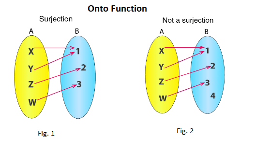

# Surjective functions

Surjective functions (also known as onto functions) are functions such that every image in the codomain of the function has at least 1 preimage.

In formal terms, $f: A \rightarrow B$ is surjective if and only if

$$
\forall (y \in B) \exists (x \in A) (f(x) = y)
$$

This can also be rephrased more simply as:

$$
f(A) = B
$$

Diagram for monkey brain:

## Function composition

Let $g: A \rightarrow B$ and $f: B \rightarrow C$
Then $f \circ g: A \rightarrow C$

Given that $f \circ g$ is surjective...

### $f$ must be surjective.

Proof:

1. Assume that $f$ is not surjective.
1. The range of $f$ does not cover the entirety of $C$, thus the range of $f \circ g$ cannot cover the entirety of $C$.
1. $f \circ g$ is not surjective and we have a contradiction.
1. $\therefore$ $f$ must be surjective.

### $g$ may not be surjective.

> Note that this does not prove that $g$ cannot be surjective, only that $g$ is not surjective in some cases.

Proof:

1. Assume that a set $D \subset B$ exists such that $f(D) = C$.
1. If $g(A) = D$, then g is not surjective since $D \neq B$.
1. But $f \circ g$ is still surjective because $f(g(A)) = f(D) = C$

Counterexample proof:

1. Let $A = \{0\}$, $B = \{1, 2\}$, $C = \{3\}$
1. Let $g = \{(0, 1)\}$
1. Let $f = \{(1, 3), (2, 3)\}$
1. Then, $f \circ g = \{(0, 3)\}$
